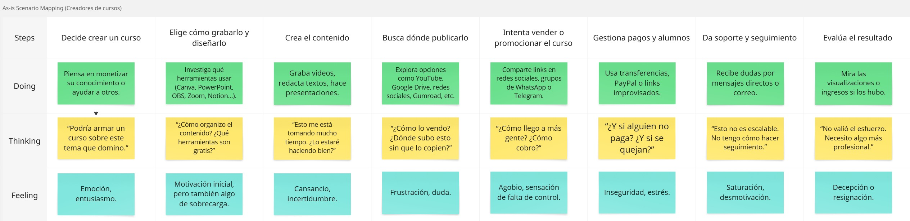

# Carátula
# Registro de Versiones del Informe
# Project Report Collaboration Insights
# Contenido
- [Carátula](#carátula)
- [Registro de Versiones del Informe](#registro-de-versiones-del-informe)
- [Project Report Collaboration Insights](#project-report-collaboration-insights)
- [Contenido](#contenido)
- [Student Outcome](#student-outcome)
- [Capítulo I: Introducción](#capítulo-i-introducción)
  - [1.1. Startup Profile.](#11-startup-profile)
    - [1.1.1. Descripción de la Startup.](#111-descripción-de-la-startup)
    - [1.1.2. Perfiles de integrantes del equipo.](#112-perfiles-de-integrantes-del-equipo)
  - [1.2. Solution Profile.](#12-solution-profile)
    - [1.2.1 Antecedentes y problemática.](#121-antecedentes-y-problemática)
    - [1.2.2 Lean UX Process.](#122-lean-ux-process)
      - [1.2.2.1. Lean UX Problem Statements.](#1221-lean-ux-problem-statements)
      - [1.2.2.2. Lean UX Assumptions.](#1222-lean-ux-assumptions)
      - [1.2.2.3. Lean UX Hypothesis Statements.](#1223-lean-ux-hypothesis-statements)
      - [1.2.2.4. Lean UX Canvas.](#1224-lean-ux-canvas)
  - [1.3. Segmentos objetivo.](#13-segmentos-objetivo)
  - [Segmento objetivo #1: Estudiantes universitarios que desean aprender](#segmento-objetivo-1-estudiantes-universitarios-que-desean-aprender)
  - [Segmento objetivo #2: Creadores de cursos](#segmento-objetivo-2-creadores-de-cursos)
- [Capítulo II: Requirements Elicitation \& Analysis](#capítulo-ii-requirements-elicitation--analysis)
  - [2.1. Competidores.](#21-competidores)
    - [2.1.1. Análisis competitivo.](#211-análisis-competitivo)
    - [2.1.2. Estrategias y tácticas frente a competidores.](#212-estrategias-y-tácticas-frente-a-competidores)
  - [2.2. Entrevistas.](#22-entrevistas)
    - [2.2.1. Diseño de entrevistas.](#221-diseño-de-entrevistas)
    - [2.2.2. Registro de entrevistas.](#222-registro-de-entrevistas)
    - [2.2.3. Análisis de entrevistas.](#223-análisis-de-entrevistas)
  - [2.3. Needfinding.](#23-needfinding)
    - [2.3.1. User Personas.](#231-user-personas)
    - [2.3.2. User Task Matrix.](#232-user-task-matrix)
    - [2.3.3. User Journey Mapping.](#233-user-journey-mapping)
    - [2.3.4. Empathy Mapping.](#234-empathy-mapping)
    - [2.3.5. As-is Scenario Mapping.](#235-as-is-scenario-mapping)
  - [2.4. Ubiquitous Language.](#24-ubiquitous-language)
- [Capítulo III: Requirements Specification](#capítulo-iii-requirements-specification)
  - [3.1. To-Be Scenario Mapping.](#31-to-be-scenario-mapping)
  - [3.2. User Stories.](#32-user-stories)
  - [3.3. Impact Mapping.](#33-impact-mapping)
  - [3.4. Product Backlog.](#34-product-backlog)
- [Capítulo IV: Product Design](#capítulo-iv-product-design)
  - [4.1. Style Guidelines.](#41-style-guidelines)
    - [4.1.1. General Style Guidelines.](#411-general-style-guidelines)
    - [4.1.2. Web Style Guidelines.](#412-web-style-guidelines)
  - [4.2. Information Architecture.](#42-information-architecture)
    - [4.2.1. Organization Systems.](#421-organization-systems)
    - [4.2.2. Labeling Systems.](#422-labeling-systems)
    - [4.2.3. SEO Tags and Meta Tags](#423-seo-tags-and-meta-tags)
    - [4.2.4. Searching Systems.](#424-searching-systems)
    - [4.2.5. Navigation Systems.](#425-navigation-systems)
  - [4.3. Landing Page UI Design.](#43-landing-page-ui-design)
    - [4.3.1. Landing Page Wireframe.](#431-landing-page-wireframe)
    - [4.3.2. Landing Page Mock-up.](#432-landing-page-mock-up)
  - [4.4. Web Applications UX/UI Design.](#44-web-applications-uxui-design)
    - [4.4.1. Web Applications Wireframes.](#441-web-applications-wireframes)
    - [4.4.2. Web Applications Wireflow Diagrams.](#442-web-applications-wireflow-diagrams)
    - [4.4.2. Web Applications Mock-ups.](#442-web-applications-mock-ups)
    - [4.4.3. Web Applications User Flow Diagrams.](#443-web-applications-user-flow-diagrams)
  - [4.5. Web Applications Prototyping.](#45-web-applications-prototyping)
  - [4.6. Domain-Driven Software Architecture.](#46-domain-driven-software-architecture)
    - [4.6.1. Software Architecture Context Diagram.](#461-software-architecture-context-diagram)
    - [4.6.2. Software Architecture Container Diagrams.](#462-software-architecture-container-diagrams)
    - [4.6.3. Software Architecture Components Diagrams.](#463-software-architecture-components-diagrams)
  - [4.7. Software Object-Oriented Design.](#47-software-object-oriented-design)
    - [4.7.1. Class Diagrams.](#471-class-diagrams)
    - [4.7.2. Class Dictionary.](#472-class-dictionary)
  - [4.8. Database Design.](#48-database-design)
    - [4.8.1. Database Diagram.](#481-database-diagram)
- [Capítulo V: Product Implementation, Validation \& Deployment](#capítulo-v-product-implementation-validation--deployment)
  - [5.1. Software Configuration Management.](#51-software-configuration-management)
    - [5.1.1. Software Development Environment Configuration.](#511-software-development-environment-configuration)
    - [5.1.2. Source Code Management.](#512-source-code-management)
    - [5.1.3. Source Code Style Guide \& Conventions.](#513-source-code-style-guide--conventions)
    - [5.1.4. Software Deployment Configuration.](#514-software-deployment-configuration)
  - [5.2. Landing Page, Services \& Applications Implementation.](#52-landing-page-services--applications-implementation)
    - [5.2.1. Sprint 1](#521-sprint-1)
      - [5.2.1.1. Sprint Planning 1.](#5211-sprint-planning-1)
      - [5.2.1.2. Aspect Leaders and Collaborators.](#5212-aspect-leaders-and-collaborators)
      - [5.2.1.3. Sprint Backlog 1.](#5213-sprint-backlog-1)
      - [5.2.1.4. Development Evidence for Sprint Review.](#5214-development-evidence-for-sprint-review)
      - [5.2.1.5. Execution Evidence for Sprint Review.](#5215-execution-evidence-for-sprint-review)
      - [5.2.1.6. Services Documentation Evidence for Sprint Review.](#5216-services-documentation-evidence-for-sprint-review)
      - [5.2.1.7. Software Deployment Evidence for Sprint Review.](#5217-software-deployment-evidence-for-sprint-review)
      - [5.2.1.8. Team Collaboration Insights during Sprint.](#5218-team-collaboration-insights-during-sprint)

# Student Outcome

# Capítulo I: Introducción
## 1.1. Startup Profile.
### 1.1.1. Descripción de la Startup.
### 1.1.2. Perfiles de integrantes del equipo.
## 1.2. Solution Profile.
### 1.2.1 Antecedentes y problemática.
En los últimos años, el aprendizaje en línea ha experimentado un crecimiento exponencial, impulsado por la digitalización, la masificación del acceso a internet y las nuevas dinámicas de enseñanza. Sin embargo, la mayoría de las plataformas existentes se enfocan en cursos de interés general, programación, idiomas o habilidades blandas, dejando de lado contenidos estrictamente académicos y universitarios, especialmente de nivel superior.

Actualmente, estudiantes universitarios que desean reforzar conocimientos específicos de sus asignaturas o prepararse para exámenes tienen dificultades para encontrar contenidos especializados en plataformas masivas. Por otro lado, docentes y profesionales con experiencia académica carecen de espacios adecuados para ofrecer cursos orientados al ámbito universitario, con herramientas pedagógicas que se ajusten a ese contexto.

Edunova surge como respuesta a esta necesidad, proponiendo una plataforma especializada que permita conectar a estudiantes, docentes y profesionales del entorno académico universitario para la creación, publicación y venta de cursos en distintas áreas del conocimiento superior.

---

**Análisis de la problemática**

| Clave  | Pregunta                                | Respuesta                                                                                                                                 |
|:--------|:------------------------------------------|:-------------------------------------------------------------------------------------------------------------------------------------------|
| **Who**  | ¿Quiénes se ven afectados?                 | Estudiantes universitarios que buscan reforzar o profundizar conocimientos, y docentes que desean compartir su experiencia académica. |
| **What** | ¿Qué ocurre?                               | No existen plataformas enfocadas exclusivamente en cursos universitarios estructurados, lo que limita la oferta y acceso a este tipo de contenido. |
| **Where**| ¿Dónde ocurre?                              | Principalmente en el ámbito digital y académico universitario de Latinoamérica, aunque la problemática es aplicable a otros entornos similares. |
| **When** | ¿Cuándo sucede?                             | Constantemente, al momento de buscar opciones de aprendizaje o recursos académicos adicionales más allá de las aulas tradicionales. |
| **Why**  | ¿Por qué es un problema?                   | Porque limita las oportunidades de aprendizaje complementario, dificulta la preparación académica y desaprovecha el potencial de expertos en distintas áreas universitarias. |
| **How**  | ¿Cómo afecta a los involucrados?            | Los estudiantes se ven obligados a recurrir a fuentes informales o incompletas; y los docentes carecen de una plataforma adecuada para difundir sus conocimientos de forma profesional. |
| **How much** | ¿Cuál es la magnitud del problema?        | Afecta a miles de estudiantes universitarios y docentes que no encuentran en plataformas generalistas una oferta académica universitaria estructurada, dificultando el acceso a recursos educativos de calidad. |

---

### 1.2.2 Lean UX Process.
#### 1.2.2.1. Lean UX Problem Statements.
#### 1.2.2.2. Lean UX Assumptions.
#### 1.2.2.3. Lean UX Hypothesis Statements.
#### 1.2.2.4. Lean UX Canvas.

El Lean UX Canvas es una herramienta clave dentro del enfoque de diseño centrado en el usuario y la metodología Lean. Su objetivo es ayudar a equipos multidisciplinarios a colaborar de forma más ágil y organizada durante el desarrollo de productos. Este lienzo proporciona una estructura clara para alinear ideas, hipótesis y objetivos, permitiendo tomar decisiones más rápidas y enfocadas en el usuario. A continuación, se muestra el Lean UX Canvas trabajado por el equipo a través de la plataforma Canva.

  

## 1.3. Segmentos objetivo.

## Segmento objetivo #1: Estudiantes universitarios que desean aprender
**Descripción:**
Este grupo está compuesto por hombres y mujeres de entre 18 y 25 años, estudiantes universitarios motivados por mejorar sus conocimientos, habilidades y desempeño académico o profesional. Buscan aprender más allá del aula: profundizar en los temas, entender mejor los contenidos y prepararse para el entorno laboral. Por ello, valoran plataformas accesibles, confiables y adaptadas a sus necesidades educativas.

**Características clave de este segmento:**

- Motivación principal: aprender más allá del aula (profundizar, entender mejor, prepararse para el futuro laboral).

- Valoran la accesibilidad (precio, formato) y la calidad del contenido.

- Suelen tener dificultades para encontrar cursos universitarios de calidad sin riesgo de ser engañados.

- Residen en zonas urbanas, son nativos digitales y utilizan redes sociales, YouTube, Google, foros académicos y apps educativas.

## Segmento objetivo #2: Creadores de cursos
**Descripción:**
Este grupo está formado por personas con conocimientos universitarios que desean compartir lo que saben y generar ingresos a través de cursos. Incluye profesores, egresados y estudiantes avanzados que dominan temas académicos o técnicos. Buscan plataformas que les permitan crear, publicar y monetizar contenido de forma sencilla, profesional y sin necesidad de conocimientos técnicos avanzados.

**Características clave de este segmento:**

- Motivación principal: compartir conocimientos, generar ingresos extra y/o construir una reputación profesional.

- Valoran herramientas fáciles de usar para crear y publicar contenido (videos, lecturas, evaluaciones, etc.).

- Buscan plataformas confiables donde puedan llegar a una audiencia interesada y mantener control sobre su contenido y ganancias.

- Tienen experiencia en su área de conocimiento, manejo digital intermedio a avanzado, y algunos ya han utilizado plataformas como YouTube, Moodle, Notion o Canva para enseñar o compartir contenido.

# Capítulo II: Requirements Elicitation & Analysis
## 2.1. Competidores.
### 2.1.1. Análisis competitivo.
### 2.1.2. Estrategias y tácticas frente a competidores.
## 2.2. Entrevistas.
### 2.2.1. Diseño de entrevistas.
**Preguntas generales**
<ul>
  <li>¿Cómo te llamas?</li>
  <li>¿Cuántos años tienes?</li>
  <li>¿Cuál es tu ocupación?</li>
</ul>

**Estudiantes**
<ol>
  <li>¿Qué medios utilizas actualmente para aprender o reforzar conocimientos universitarios fuera de clase?</li>
  <li>¿Has tomado algún curso online de contenido universitario? ¿Qué te gustó o qué mejorarías?</li>
  <li>¿Qué características consideras importantes en un curso online universitario?</li>
  <li>¿Qué dificultades has tenido al buscar o tomar cursos online universitarios?</li>
  <li>¿Desde qué dispositivos sueles estudiar? ¿Qué plataformas educativas has usado?</li>
  <li>¿Qué te motivaría a pagar por un curso universitario online?</li>
  <li>¿Qué valoras más de un curso online: el contenido, la interacción con el docente, el certificado, u otro?</li>
  <li>¿Prefieres cursos con clases en vivo, grabadas, o materiales descargables? ¿Por qué?</li>
  <li>¿Cómo sueles enterarte de cursos online? ¿Qué formato o promoción te llama más la atención?</li>
</ol>

**Instructores**
<ol>
  <li>¿En qué géneros te especializas como escritor? ¿Qué te atrae de esos géneros?</li>
  <li>¿Has creado o dictado cursos online anteriormente? ¿En qué plataformas?</li>
  <li>¿Qué te motivaría a crear un curso online de contenido universitario?</li>
  <li>¿Qué funcionalidades considerarías necesarias en una plataforma para publicar y vender tus cursos?</li>
  <li>¿Qué dificultades has tenido al publicar cursos online en otras plataformas?</li>
  <li>¿Cómo prefieres organizar tus cursos: por módulos, por temas, por nivel?</li>
  <li>¿Qué herramientas sueles usar para dictar clases?</li>
  <li>¿Qué modelo de pago prefieres para tus cursos: pago único, suscripción, descuentos?</li>
  <li>¿Qué medios prefieres para comunicarte con tus estudiantes?</li>
  <li>¿Qué tipo de reportes o estadísticas te gustaría recibir sobre tus cursos y estudiantes?</li>
  <li>¿Te gustaría que la plataforma permita ofrecer certificados de finalización?</li>
</ol>

### 2.2.2. Registro de entrevistas.

<h4>Link: <a href="https://upcedupe-my.sharepoint.com/:v:/g/personal/u202113111_upc_edu_pe/ERNkA032CM9FiJ7MUAdyGXIBFGNkEVbN7aNAAdnzzkaTsw?e=SRS70s&nav=eyJyZWZlcnJhbEluZm8iOnsicmVmZXJyYWxBcHAiOiJTdHJlYW1XZWJBcHAiLCJyZWZlcnJhbFZpZXciOiJTaGFyZURpYWxvZy1MaW5rIiwicmVmZXJyYWxBcHBQbGF0Zm9ybSI6IldlYiIsInJlZmVycmFsTW9kZSI6InZpZXcifX0%3D">Click para ver las entrevistas</a></h4>

**Estudiantes:**  
Entrevista #1: Jeremy Eredia
<ul>
    <li>
        Link: <a href="https://upcedupe-my.sharepoint.com/:v:/g/personal/u202113111_upc_edu_pe/ERNkA032CM9FiJ7MUAdyGXIBFGNkEVbN7aNAAdnzzkaTsw?e=cV7HdC&nav=eyJyZWZlcnJhbEluZm8iOnsicmVmZXJyYWxBcHAiOiJTdHJlYW1XZWJBcHAiLCJyZWZlcnJhbFZpZXciOiJTaGFyZURpYWxvZy1MaW5rIiwicmVmZXJyYWxBcHBQbGF0Zm9ybSI6IldlYiIsInJlZmVycmFsTW9kZSI6InZpZXcifSwicGxheWJhY2tPcHRpb25zIjp7InN0YXJ0VGltZUluU2Vjb25kcyI6MC40N319">Click para ver entrevista</a>
    </li>
    <li>
        Duración: 5:57
    </li>
    <li>
        Inicio: 0:00
    </li>
    <li>
        Entrevistador: Tony Torres
    </li>
</ul>

Resumen:

    Jeremy Eredia, estudiante universitario de 24 años, utiliza principalmente las diapositivas proporcionadas por sus profesores y videos de YouTube para reforzar sus conocimientos académicos. Aunque no ha tomado cursos online previamente, se muestra interesado en inscribirse en uno de Excel avanzado, valorando especialmente la interacción con docentes y alumnos, y la correcta gestión de la tecnología. Considera que los cursos online deberían tener precios más accesibles que los presenciales debido a los menores costos. Ha enfrentado dificultades para encontrar cursos universitarios de calidad, debido a la escasa oferta disponible a lo largo del año. Prefiere estudiar desde una computadora de escritorio y usa plataformas como Sumadi y Blackboard. Se siente motivado a pagar por cursos que complementen su formación profesional, especialmente aquellos con demanda laboral inmediata. Valora propuestas que combinen clases en vivo, grabadas y materiales descargables, aunque considera que las actuales estrategias de promoción de cursos no logran captar su atención.

---

Entrevista #2: Aldo Vasquez Sotomayor
<ul>
    <li>
        Link: <a href="https://upcedupe-my.sharepoint.com/:v:/g/personal/u202113111_upc_edu_pe/ERNkA032CM9FiJ7MUAdyGXIBFGNkEVbN7aNAAdnzzkaTsw?e=0sP4dx&nav=eyJyZWZlcnJhbEluZm8iOnsicmVmZXJyYWxBcHAiOiJTdHJlYW1XZWJBcHAiLCJyZWZlcnJhbFZpZXciOiJTaGFyZURpYWxvZy1MaW5rIiwicmVmZXJyYWxBcHBQbGF0Zm9ybSI6IldlYiIsInJlZmVycmFsTW9kZSI6InZpZXcifSwicGxheWJhY2tPcHRpb25zIjp7InN0YXJ0VGltZUluU2Vjb25kcyI6MzU3Ljk0fX0%3D">Click para ver entrevista</a>
    </li>
    <li>
        Duración: 4:06
    </li>
    <li>
        Inicio: 5:57
    </li>
    <li>
        Entrevistador: Cristian Iparraguirre 
    </li>
</ul>

Resumen:

    Estudiante universitario de 21 años, el entrevistado utiliza principalmente videos de YouTube, documentos PDF, presentaciones de profesores y aplicaciones como Quizlet para reforzar sus estudios universitarios. Ha tomado cursos online de investigación académica, valorando la flexibilidad de horarios y el acceso permanente a los contenidos, aunque señala como punto débil la escasa interacción docente. Considera esenciales para un curso online universitario las clases grabadas, materiales descargables, foros de consulta, precios accesibles y certificación válida. Ha enfrentado dificultades para encontrar cursos especializados de nivel universitario y plataformas con horarios flexibles. Estudia principalmente desde su laptop y, en menor medida, desde el celular, utilizando plataformas como Blackboard, Moodle, Google Classroom y Zoom. Se siente motivado a pagar por cursos que complementen sus estudios o sean útiles laboralmente, siempre que tengan contenido de calidad y buenos docentes. Prioriza el contenido por encima de otros aspectos y prefiere cursos con clases grabadas combinadas con materiales descargables, considerando las sesiones en vivo solo para resolver dudas. Se informa sobre cursos principalmente a través de redes sociales, WhatsApp y páginas universitarias, siendo más atractivo para él cuando existen promociones o descuentos dirigidos a estudiantes.

---

Entrevista #3: Daniel Monago
<ul>
    <li>
        Link: <a href="https://upcedupe-my.sharepoint.com/:v:/g/personal/u202113111_upc_edu_pe/ERNkA032CM9FiJ7MUAdyGXIBFGNkEVbN7aNAAdnzzkaTsw?e=3fAqCP&nav=eyJyZWZlcnJhbEluZm8iOnsicmVmZXJyYWxBcHAiOiJTdHJlYW1XZWJBcHAiLCJyZWZlcnJhbFZpZXciOiJTaGFyZURpYWxvZy1MaW5rIiwicmVmZXJyYWxBcHBQbGF0Zm9ybSI6IldlYiIsInJlZmVycmFsTW9kZSI6InZpZXcifSwicGxheWJhY2tPcHRpb25zIjp7InN0YXJ0VGltZUluU2Vjb25kcyI6NjA0Ljd9fQ%3D%3D">Click para ver entrevista</a>
    </li>
    <li>
        Duración: 5:43
    </li>
    <li>
        Inicio: 10:04
    </li>
    <li>
        Entrevistador: Valentino Alvarez
    </li>
</ul>

Resumen:

    Daniel Monago, estudiante universitario de 19 años, utiliza principalmente las presentaciones compartidas por sus profesores y plataformas como Google Classroom, Google Meet y Microsoft Teams para complementar sus estudios. Prefiere estudiar desde su celular, aunque también usa su laptop cuando asiste a la universidad. Ha tomado cursos online, como uno de quechua, y considera esencial que estos fomenten la participación sin temor a equivocarse, valorando ambientes dinámicos y profesores interactivos. Prefiere las clases en vivo, ya que le permiten resolver dudas en tiempo real, aunque enfrenta dificultades para compatibilizar los horarios de los cursos virtuales con sus clases presenciales. Daniel prioriza cursos que ofrezcan certificación válida, contenidos de calidad y flexibilidad horaria. Está dispuesto a pagar por cursos que garanticen estos beneficios, destacando la importancia del aprendizaje activo y práctico como base para una educación significativa y alineada a sus intereses profesionales.

---

Entrevista #4: Sayry Ayvar
<ul>
    <li>
        Link: <a href="https://upcedupe-my.sharepoint.com/:v:/g/personal/u202113111_upc_edu_pe/ERNkA032CM9FiJ7MUAdyGXIBFGNkEVbN7aNAAdnzzkaTsw?e=AQyZyu&nav=eyJyZWZlcnJhbEluZm8iOnsicmVmZXJyYWxBcHAiOiJTdHJlYW1XZWJBcHAiLCJyZWZlcnJhbFZpZXciOiJTaGFyZURpYWxvZy1MaW5rIiwicmVmZXJyYWxBcHBQbGF0Zm9ybSI6IldlYiIsInJlZmVycmFsTW9kZSI6InZpZXcifSwicGxheWJhY2tPcHRpb25zIjp7InN0YXJ0VGltZUluU2Vjb25kcyI6OTQ3LjYyfX0%3D">Click para ver entrevista</a>
    </li>
    <li>
        Duración: 6:05
    </li>
    <li>
        Inicio: 15:47
    </li>
    <li>
        Entrevistador: Valentino Alvarez
    </li>
</ul>

Resumen:

    Sayry, estudiante de 19 años de Comunicación y Fotografía en la UPC, combina su formación presencial con contenidos virtuales, valorando principalmente la calidad del material proporcionado en las aulas virtuales. Utiliza una PC, laptop y ocasionalmente su celular, recurriendo a plataformas como YouTube para complementar su aprendizaje. Ha participado en talleres online, destacando la importancia de la personalización y los grupos reducidos, ya que favorecen la interacción directa con los docentes. Prefiere cursos en vivo por la posibilidad de resolver dudas en el momento y considera esencial una buena conectividad y una supervisión adecuada. La flexibilidad horaria es su principal motivación para pagar por un curso universitario online. Sayry se informa sobre cursos mediante redes sociales como Facebook e Instagram, valorando las promociones que destacan la interactividad y facilitan el contacto directo con los instructores. En general, busca experiencias de aprendizaje personalizadas, accesibles y con comunicación fluida, reflejando la necesidad de que la educación digital se adapte a los estilos de vida y preferencias de los estudiantes actuales.

---

Entrevista #5: Sebastián Silva
<ul>
    <li>
        Link: <a href="https://upcedupe-my.sharepoint.com/:v:/g/personal/u202113111_upc_edu_pe/ERNkA032CM9FiJ7MUAdyGXIBFGNkEVbN7aNAAdnzzkaTsw?e=d7fd7F&nav=eyJyZWZlcnJhbEluZm8iOnsicmVmZXJyYWxBcHAiOiJTdHJlYW1XZWJBcHAiLCJyZWZlcnJhbFZpZXciOiJTaGFyZURpYWxvZy1MaW5rIiwicmVmZXJyYWxBcHBQbGF0Zm9ybSI6IldlYiIsInJlZmVycmFsTW9kZSI6InZpZXcifSwicGxheWJhY2tPcHRpb25zIjp7InN0YXJ0VGltZUluU2Vjb25kcyI6MTMxMi44MX19">Click para ver entrevista</a>
    </li>
    <li>
        Duración: 5:52
    </li>
    <li>
        Inicio: 21:52
    </li>
    <li>
        Entrevistador: Diego Acuña
    </li>
</ul>

Resumen:

    Sebastián Silva, estudiante universitario de 21 años, busca complementar su formación académica a través de cursos online, mostrando una actitud proactiva y curiosa por aprender. Utiliza principalmente su computadora para estudiar, aunque también emplea tablet y móvil. Ha explorado plataformas como UDEMY, Cursa y Demio, prefiriendo clases grabadas por la flexibilidad que ofrecen para gestionar su tiempo. Valora la calidad del docente, la estructura del contenido y los recursos disponibles, considerando la certificación como un valor adicional pero secundario. Ha enfrentado dificultades para encontrar cursos específicos que se ajusten a sus intereses, especialmente en Coursera. Descubre la mayoría de los cursos a través de redes sociales, siendo receptivo a anuncios de áreas como programación y hacking ético. Sebastián representa a un estudiante digital enfocado en el aprendizaje autónomo, con expectativas claras sobre calidad, accesibilidad y valor práctico en la educación online.

---

**Instructores:**  
Entrevista #1: Alexia Acuña
<ul>
    <li>
        Link: <a href="https://upcedupe-my.sharepoint.com/:v:/g/personal/u202113111_upc_edu_pe/ERNkA032CM9FiJ7MUAdyGXIBFGNkEVbN7aNAAdnzzkaTsw?e=RAClx9&nav=eyJyZWZlcnJhbEluZm8iOnsicmVmZXJyYWxBcHAiOiJTdHJlYW1XZWJBcHAiLCJyZWZlcnJhbFZpZXciOiJTaGFyZURpYWxvZy1MaW5rIiwicmVmZXJyYWxBcHBQbGF0Zm9ybSI6IldlYiIsInJlZmVycmFsTW9kZSI6InZpZXcifSwicGxheWJhY2tPcHRpb25zIjp7InN0YXJ0VGltZUluU2Vjb25kcyI6MTY2NS41OH19">Click para ver entrevista</a>
    </li>
    <li>
        Duración: 7:10
    </li>
    <li>
        Inicio: 27:45
    </li>
    <li>
        Entrevistador: Diego Acuña
    </li>
</ul>

Resumen:

    Alexia Acuña, joven profesional de 25 años, ha tenido experiencias enseñando de manera voluntaria a niños de bajos recursos, lo que la motiva a considerar la enseñanza universitaria online en el futuro. Tiene una marcada orientación hacia el aprendizaje colaborativo, valorando la interacción y dinamismo en las plataformas educativas. Prefiere herramientas como Microsoft Teams, PowerPoint y Canva por su enfoque visual, aunque también ha usado Zoom y Google Meet. Organizaría sus cursos por temas, alineándolos con distintas áreas de estudio universitario, con módulos específicos por materia. Para comunicarse con sus estudiantes, propone foros, correos y grupos de WhatsApp, buscando mantener una interacción activa. Considera indispensable ofrecer certificados de finalización, y espera acceder a estadísticas sobre perfiles, tiempos de cursado y feedback de los alumnos. En cuanto al modelo de pago, prefiere el pago único, priorizando la simplicidad en las transacciones. Alexia destaca por su visión de educación online accesible, interactiva y con valor profesional para los estudiantes.

---

Entrevista #2: Alonso Robles
<ul>
    <li>
        Link: <a href="https://upcedupe-my.sharepoint.com/:v:/g/personal/u202113111_upc_edu_pe/ERNkA032CM9FiJ7MUAdyGXIBFGNkEVbN7aNAAdnzzkaTsw?e=E2nEDe&nav=eyJyZWZlcnJhbEluZm8iOnsicmVmZXJyYWxBcHAiOiJTdHJlYW1XZWJBcHAiLCJyZWZlcnJhbFZpZXciOiJTaGFyZURpYWxvZy1MaW5rIiwicmVmZXJyYWxBcHBQbGF0Zm9ybSI6IldlYiIsInJlZmVycmFsTW9kZSI6InZpZXcifSwicGxheWJhY2tPcHRpb25zIjp7InN0YXJ0VGltZUluU2Vjb25kcyI6MjA5NS4xNX19">Click para ver entrevista</a>
    </li>
    <li>
        Duración: 6:41
    </li>
    <li>
        Inicio: 34:54
    </li>
    <li>
        Entrevistador: Cristian Iparraguirre 
    </li>
</ul>

Resumen:

    El entrevistado es un estudiante universitario de ciclos avanzados que dicta cursos básicos en su universidad. Ha impartido talleres online utilizando principalmente Google Meet y Moodle, complementando con videos compartidos por YouTube y Google Drive. Su motivación para crear cursos online es compartir conocimientos con estudiantes de ciclos iniciales, obtener ingresos adicionales y dejar contenidos accesibles para reforzar aprendizajes. Considera esenciales funcionalidades como organización modular, carga de videos, documentos, clases en vivo, control de precios, estadísticas, foros y certificados. Ha enfrentado dificultades con la personalización y seguimiento del progreso en otras plataformas. Prefiere organizar sus cursos por módulos, usar Google Meet y Google Classroom, y establecer un modelo de pago único con posibilidad de descuentos. Para comunicarse con los estudiantes, prefiere chats o foros integrados en la plataforma. Valora recibir reportes sobre inscripciones, progreso, notas, y valoraciones de los cursos. Finalmente, considera importante ofrecer certificados de finalización como incentivo y valor agregado.

---

Entrevista #3: Violeta Cortés
<ul>
    <li>
        Link: <a href="https://upcedupe-my.sharepoint.com/:v:/g/personal/u202113111_upc_edu_pe/ERNkA032CM9FiJ7MUAdyGXIBFGNkEVbN7aNAAdnzzkaTsw?e=W9Pjuy&nav=eyJyZWZlcnJhbEluZm8iOnsicmVmZXJyYWxBcHAiOiJTdHJlYW1XZWJBcHAiLCJyZWZlcnJhbFZpZXciOiJTaGFyZURpYWxvZy1MaW5rIiwicmVmZXJyYWxBcHBQbGF0Zm9ybSI6IldlYiIsInJlZmVycmFsTW9kZSI6InZpZXcifSwicGxheWJhY2tPcHRpb25zIjp7InN0YXJ0VGltZUluU2Vjb25kcyI6MjQ5Ni45NX19">Click para ver entrevista</a>
    </li>
    <li>
        Duración: 9:14
    </li>
    <li>
        Inicio: 41:36
    </li>
    <li>
        Entrevistador: Tony Torres 
    </li>
</ul>

Resumen:

    Violeta Cortés, profesora universitaria de 49 años, ha creado cursos online utilizando plataformas como Zoom y Google Meet, combinando estas herramientas con recursos interactivos y presentaciones visuales. Está motivada por mejorar la educación universitaria, integrando contenido, evaluaciones y espacios para recibir sugerencias de los estudiantes. Prefiere plataformas que permitan videoconferencias, grabaciones accesibles y foros, valorando la interacción constante. En sus inicios enfrentó problemas técnicos relacionados con la duración de sesiones y limitaciones de conectividad, pero ha superado estas dificultades con mejor equipamiento. Organiza sus cursos por módulos, estructurando niveles básico, intermedio y avanzado según el tema. En cuanto al modelo de pago, considera viable tanto suscripción como pago único, aunque sugiere proteger los materiales para evitar mal uso. Está a favor de emitir certificados de finalización y desea recibir reportes estadísticos sobre el rendimiento y participación de sus estudiantes, lo que le permitiría mejorar sus cursos. Violeta destaca por su enfoque práctico, flexible y centrado en la interacción como pilar de la educación online.

---

Entrevista #4: Luis Iparraguirre
<ul>
    <li>
        Link: <a href="https://upcedupe-my.sharepoint.com/:v:/g/personal/u202113111_upc_edu_pe/ERNkA032CM9FiJ7MUAdyGXIBFGNkEVbN7aNAAdnzzkaTsw?e=fVFTgG&nav=eyJyZWZlcnJhbEluZm8iOnsicmVmZXJyYWxBcHAiOiJTdHJlYW1XZWJBcHAiLCJyZWZlcnJhbFZpZXciOiJTaGFyZURpYWxvZy1MaW5rIiwicmVmZXJyYWxBcHBQbGF0Zm9ybSI6IldlYiIsInJlZmVycmFsTW9kZSI6InZpZXcifSwicGxheWJhY2tPcHRpb25zIjp7InN0YXJ0VGltZUluU2Vjb25kcyI6MzA1MS41NX19">Click para ver entrevista</a>
    </li>
    <li>
        Duración: 11:00
    </li>
    <li>
        Inicio: 50:51
    </li>
    <li>
        Entrevistador: Cristian Iparraguirre 
    </li>
</ul>

Resumen:

    Luis, profesor universitario y periodista de 49 años, dicta cursos online en la Universidad Peruana de Ciencias Aplicadas, utilizando plataformas como Google Meet, Microsoft Teams y Blackboard. Muestra un fuerte interés por innovar en la educación y enriquecer la experiencia de aprendizaje mediante recursos digitales como podcasts, quizzes y materiales visuales. Sin embargo, enfrenta desafíos como la falta de tiempo y dificultades técnicas, especialmente con la interfaz de plataformas y la conexión a internet. Prefiere organizar sus cursos por temas, adaptándolos a la coyuntura actual, lo que le permite ofrecer contenido relevante. En cuanto a la interacción, valora el uso de pizarras electrónicas y espacios que fomenten la comunicación activa entre docentes y estudiantes. Se comunica principalmente a través de las plataformas durante clase, y fuera de ellas mediante WhatsApp con el delegado. Está a favor de ofrecer certificados de finalización y prefiere un modelo de pago único o suscripción anual para mayor comodidad. Luis destaca como un educador comprometido con la mejora continua, que busca incorporar tecnología y flexibilidad en su enseñanza online.

### 2.2.3. Análisis de entrevistas.
## 2.3. Needfinding.
### 2.3.1. User Personas.
### 2.3.2. User Task Matrix.
### 2.3.3. User Journey Mapping.
### 2.3.4. Empathy Mapping.
### 2.3.5. As-is Scenario Mapping.

**Segmento Objetivo: Estudiantes universitarios que desean aprender**

  

**Segmento Objetivo: Creadores de cursos**

  

## 2.4. Ubiquitous Language.

# Capítulo III: Requirements Specification
## 3.1. To-Be Scenario Mapping.

**Segmento Objetivo: Estudiantes universitarios que desean aprender**

  

**Segmento Objetivo: Creadores de cursos**

  

## 3.2. User Stories.
## 3.3. Impact Mapping.
## 3.4. Product Backlog.

# Capítulo IV: Product Design
## 4.1. Style Guidelines.
### 4.1.1. General Style Guidelines.
### 4.1.2. Web Style Guidelines.
## 4.2. Information Architecture.
### 4.2.1. Organization Systems.
### 4.2.2. Labeling Systems.
### 4.2.3. SEO Tags and Meta Tags
### 4.2.4. Searching Systems.
### 4.2.5. Navigation Systems.
## 4.3. Landing Page UI Design.
### 4.3.1. Landing Page Wireframe.
### 4.3.2. Landing Page Mock-up.
## 4.4. Web Applications UX/UI Design.
### 4.4.1. Web Applications Wireframes.
### 4.4.2. Web Applications Wireflow Diagrams.
### 4.4.2. Web Applications Mock-ups.
### 4.4.3. Web Applications User Flow Diagrams.
## 4.5. Web Applications Prototyping.
## 4.6. Domain-Driven Software Architecture.
### 4.6.1. Software Architecture Context Diagram.
### 4.6.2. Software Architecture Container Diagrams.
### 4.6.3. Software Architecture Components Diagrams.
## 4.7. Software Object-Oriented Design.
### 4.7.1. Class Diagrams.
### 4.7.2. Class Dictionary.
## 4.8. Database Design.
### 4.8.1. Database Diagram.

# Capítulo V: Product Implementation, Validation & Deployment
## 5.1. Software Configuration Management.
### 5.1.1. Software Development Environment Configuration.
### 5.1.2. Source Code Management.
### 5.1.3. Source Code Style Guide & Conventions.
### 5.1.4. Software Deployment Configuration.
## 5.2. Landing Page, Services & Applications Implementation.
### 5.2.1. Sprint 1
#### 5.2.1.1. Sprint Planning 1.
#### 5.2.1.2. Aspect Leaders and Collaborators.
#### 5.2.1.3. Sprint Backlog 1.
#### 5.2.1.4. Development Evidence for Sprint Review.
#### 5.2.1.5. Execution Evidence for Sprint Review.
#### 5.2.1.6. Services Documentation Evidence for Sprint Review.
#### 5.2.1.7. Software Deployment Evidence for Sprint Review.
#### 5.2.1.8. Team Collaboration Insights during Sprint.