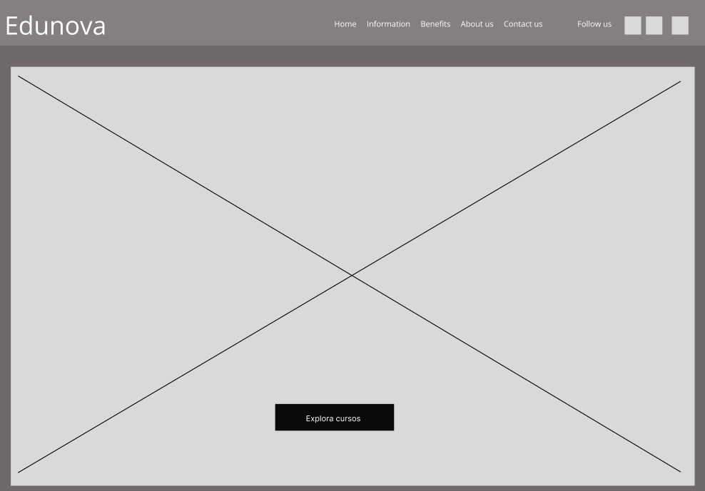
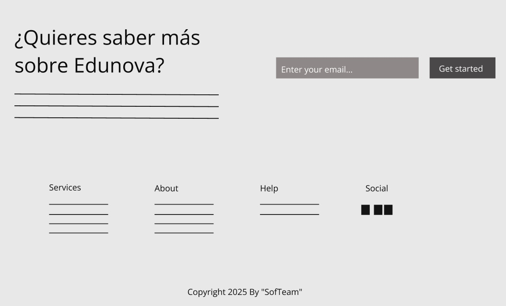
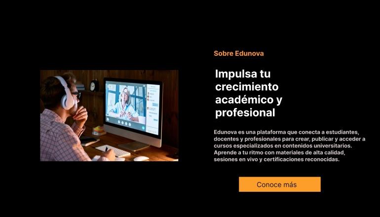
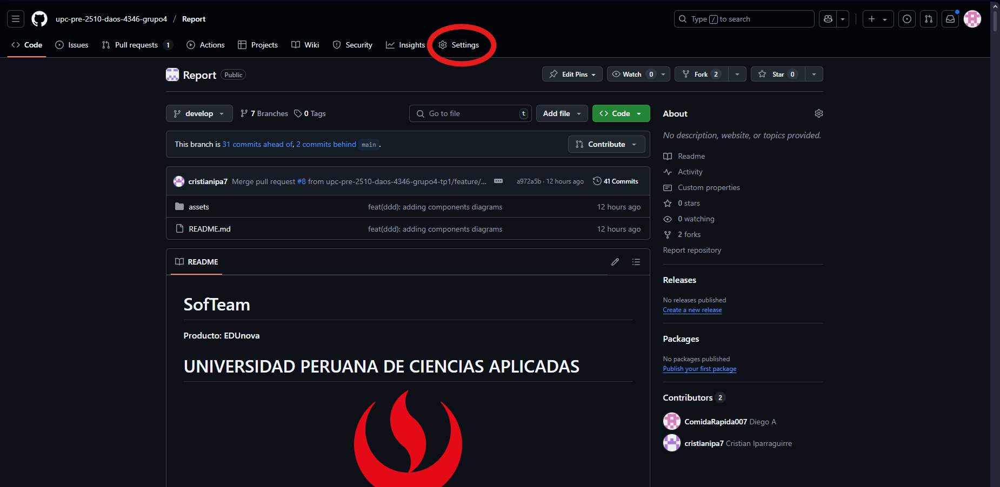
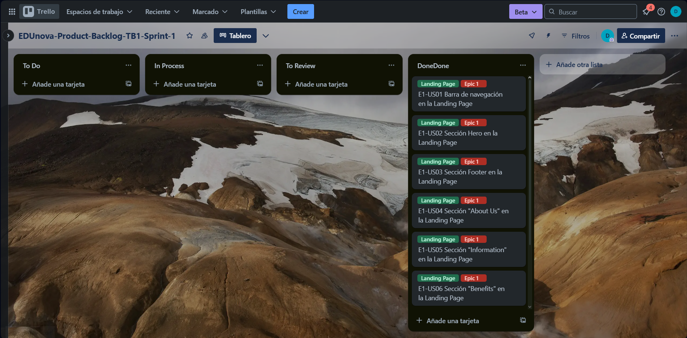
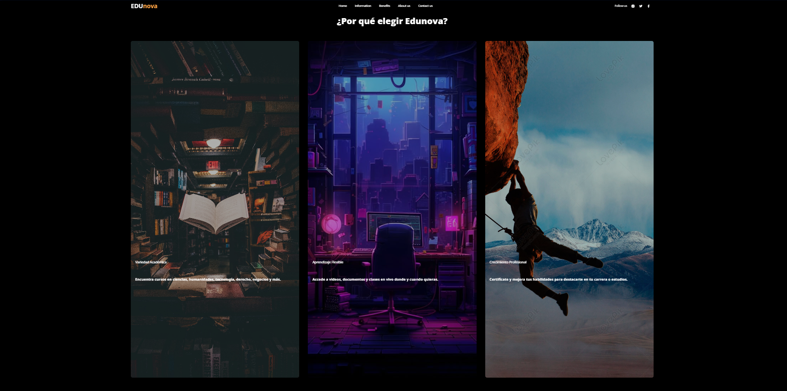

# SofTeam  
**Producto: EDUnova**  
# UNIVERSIDAD PERUANA DE CIENCIAS APLICADAS

<p align="center">
  
</p>


### Carrera: Ingeniería de Software  
### Ciclo: 5° ciclo  
### Curso: Desarrollo de Aplicaciones Open Source
### Sección: 1ASI0729
### Profesor: Rafael Oswaldo Castro Veramendi

## Informe de Trabajo Final  
**"SofTeam"**  
**Producto: "EDUnova"**

### Integrantes:
- Diego Rolin Acuña Tomas – U202221436  
- Tony Do Santos Torres Cortez - U201917662
-  
-   

**Abril, 2025**  
**URL del proyecto:** [https://github.com/upc-pre-2510-daos-4346-grupo4-tp1](https://github.com/upc-pre-2510-daos-4346-grupo4-tp1)

---


# Registro de Versiones del Informe

| Versión | Fecha       | Autor | Descripción |
|---------|-------------|-------|-------------|

# Project Report Collaboration Insights

- **URL de la organización del proyecto:**  
  [https://github.com/upc-pre-2510-daos-4346-grupo4-tp1](https://github.com/upc-pre-2510-daos-4346-grupo4-tp1)
- **URL del repositorio del informe:**  
  [https://github.com/upc-pre-2510-daos-4346-grupo4-tp1/Report](https://github.com/upc-pre-2510-daos-4346-grupo4-tp1/Report)


# Contenido
- [SofTeam](#softeam)
- [UNIVERSIDAD PERUANA DE CIENCIAS APLICADAS](#universidad-peruana-de-ciencias-aplicadas)
    - [Carrera: Ingeniería de Software](#carrera-ingeniería-de-software)
    - [Ciclo: 5° ciclo](#ciclo-5-ciclo)
    - [Curso: Desarrollo de Aplicaciones Open Source](#curso-desarrollo-de-aplicaciones-open-source)
    - [Sección: 1ASI0729](#sección-1asi0729)
    - [Profesor: Rafael Oswaldo Castro Veramendi](#profesor-rafael-oswaldo-castro-veramendi)
  - [Informe de Trabajo Final](#informe-de-trabajo-final)
    - [Integrantes:](#integrantes)
- [Registro de Versiones del Informe](#registro-de-versiones-del-informe)
- [Project Report Collaboration Insights](#project-report-collaboration-insights)
- [Contenido](#contenido)
- [Student Outcome](#student-outcome)
- [Capítulo I: Introducción](#capítulo-i-introducción)
  - [1.1. Startup Profile.](#11-startup-profile)
    - [1.1.1. Descripción de la Startup.](#111-descripción-de-la-startup)
    - [1.1.2. Perfiles de integrantes del equipo.](#112-perfiles-de-integrantes-del-equipo)
  - [1.2. Solution Profile.](#12-solution-profile)
    - [1.2.1 Antecedentes y problemática.](#121-antecedentes-y-problemática)
    - [1.2.2 Lean UX Process.](#122-lean-ux-process)
      - [1.2.2.1. Lean UX Problem Statements.](#1221-lean-ux-problem-statements)
      - [1.2.2.2. Lean UX Assumptions.](#1222-lean-ux-assumptions)
      - [1.2.2.3. Lean UX Hypothesis Statements.](#1223-lean-ux-hypothesis-statements)
      - [1.2.2.4. Lean UX Canvas.](#1224-lean-ux-canvas)
  - [1.3. Segmentos objetivo.](#13-segmentos-objetivo)
  - [Segmento objetivo #1: Estudiantes universitarios que desean aprender](#segmento-objetivo-1-estudiantes-universitarios-que-desean-aprender)
  - [Segmento objetivo #2: Creadores de cursos](#segmento-objetivo-2-creadores-de-cursos)
- [Capítulo II: Requirements Elicitation \& Analysis](#capítulo-ii-requirements-elicitation--analysis)
  - [2.1. Competidores.](#21-competidores)
    - [2.1.1. Análisis competitivo.](#211-análisis-competitivo)
- [Competitive Analysis Landscape](#competitive-analysis-landscape)
    - [2.1.2. Estrategias y tácticas frente a competidores.](#212-estrategias-y-tácticas-frente-a-competidores)
  - [2.2. Entrevistas.](#22-entrevistas)
    - [2.2.1. Diseño de entrevistas.](#221-diseño-de-entrevistas)
    - [2.2.2. Registro de entrevistas.](#222-registro-de-entrevistas)
    - [2.2.3. Análisis de entrevistas.](#223-análisis-de-entrevistas)
  - [2.3. Needfinding.](#23-needfinding)
    - [2.3.1. User Personas.](#231-user-personas)
    - [2.3.2. User Task Matrix.](#232-user-task-matrix)
    - [2.3.3. User Journey Mapping.](#233-user-journey-mapping)
    - [2.3.4. Empathy Mapping.](#234-empathy-mapping)
    - [2.3.5. As-is Scenario Mapping.](#235-as-is-scenario-mapping)
  - [2.4. Ubiquitous Language.](#24-ubiquitous-language)
- [Capítulo III: Requirements Specification](#capítulo-iii-requirements-specification)
  - [3.1. To-Be Scenario Mapping.](#31-to-be-scenario-mapping)
  - [3.2. User Stories.](#32-user-stories)
  - [3.3. Impact Mapping.](#33-impact-mapping)
  - [3.4. Product Backlog.](#34-product-backlog)
- [Capítulo IV: Product Design](#capítulo-iv-product-design)
  - [4.1. Style Guidelines.](#41-style-guidelines)
    - [4.1.1. General Style Guidelines.](#411-general-style-guidelines)
    - [4.1.2. Web Style Guidelines.](#412-web-style-guidelines)
  - [4.2. Information Architecture.](#42-information-architecture)
    - [4.2.1. Organization Systems.](#421-organization-systems)
    - [4.2.2. Labeling Systems.](#422-labeling-systems)
    - [4.2.3. SEO Tags and Meta Tags](#423-seo-tags-and-meta-tags)
    - [1. Landing Page](#1-landing-page)
    - [4.2.4. Searching Systems.](#424-searching-systems)
    - [4.2.5. Navigation Systems.](#425-navigation-systems)
    - [1. Landing Page](#1-landing-page-1)
  - [4.3. Landing Page UI Design.](#43-landing-page-ui-design)
    - [4.3.1. Landing Page Wireframe.](#431-landing-page-wireframe)
    - [4.3.2. Landing Page Mock-up.](#432-landing-page-mock-up)
  - [4.4. Web Applications UX/UI Design.](#44-web-applications-uxui-design)
    - [4.4.1. Web Applications Wireframes.](#441-web-applications-wireframes)
    - [4.4.2. Web Applications Wireflow Diagrams.](#442-web-applications-wireflow-diagrams)
    - [4.4.2. Web Applications Mock-ups.](#442-web-applications-mock-ups)
    - [4.4.3. Web Applications User Flow Diagrams.](#443-web-applications-user-flow-diagrams)
  - [4.5. Web Applications Prototyping.](#45-web-applications-prototyping)
  - [4.6. Domain-Driven Software Architecture.](#46-domain-driven-software-architecture)
    - [4.6.1. Software Architecture Context Diagram.](#461-software-architecture-context-diagram)
    - [4.6.2. Software Architecture Container Diagram.](#462-software-architecture-container-diagram)
    - [4.6.3. Software Architecture Components Diagrams.](#463-software-architecture-components-diagrams)
  - [4.7. Software Object-Oriented Design.](#47-software-object-oriented-design)
    - [4.7.1. Class Diagrams.](#471-class-diagrams)
    - [4.7.2. Class Dictionary.](#472-class-dictionary)
  - [4.8. Database Design.](#48-database-design)
    - [4.8.1. Database Diagram.](#481-database-diagram)
- [Capítulo V: Product Implementation, Validation \& Deployment](#capítulo-v-product-implementation-validation--deployment)
  - [5.1. Software Configuration Management.](#51-software-configuration-management)
    - [5.1.1. Software Development Environment Configuration.](#511-software-development-environment-configuration)
      - [Project Management](#project-management)
      - [Requirement Management](#requirement-management)
  - [| **Miro** | Plataforma colaborativa en línea utilizada para la creación de pizarras visuales, facilitando la lluvia de ideas, la planificación de flujos de trabajo y la representación de conceptos clave del proyecto. | miro.com |](#-miro--plataforma-colaborativa-en-línea-utilizada-para-la-creación-de-pizarras-visuales-facilitando-la-lluvia-de-ideas-la-planificación-de-flujos-de-trabajo-y-la-representación-de-conceptos-clave-del-proyecto--mirocom-)
      - [Product UX/UI Design](#product-uxui-design)
      - [Software Development](#software-development)
      - [Software Documentation](#software-documentation)
      - [Software Deployment](#software-deployment)
    - [5.1.2. Source Code Management.](#512-source-code-management)
      - [Producto y Repositorio](#producto-y-repositorio)
      - [Estructura del Repositorio](#estructura-del-repositorio)
      - [Flujo de trabajo GitFlow](#flujo-de-trabajo-gitflow)
      - [Mensajes de Commits](#mensajes-de-commits)
      - [Documentación](#documentación)
    - [5.1.3. Source Code Style Guide \& Conventions.](#513-source-code-style-guide--conventions)
      - [HTML](#html)
      - [CSS](#css)
      - [JavaScript](#javascript)
    - [5.1.4. Software Deployment Configuration.](#514-software-deployment-configuration)
      - [Landing Page](#landing-page)
      - [Control de Versiones](#control-de-versiones)
  - [5.2. Landing Page, Services \& Applications Implementation.](#52-landing-page-services--applications-implementation)
    - [5.2.1. Sprint 1](#521-sprint-1)
      - [5.2.1.1. Sprint Planning 1.](#5211-sprint-planning-1)
      - [5.2.1.2. Aspect Leaders and Collaborators.](#5212-aspect-leaders-and-collaborators)
      - [5.2.1.3. Sprint Backlog 1.](#5213-sprint-backlog-1)
      - [5.2.1.4. Development Evidence for Sprint Review.](#5214-development-evidence-for-sprint-review)
      - [5.2.1.5. Execution Evidence for Sprint Review.](#5215-execution-evidence-for-sprint-review)
      - [5.2.1.6. Services Documentation Evidence for Sprint Review.](#5216-services-documentation-evidence-for-sprint-review)
      - [5.2.1.7. Software Deployment Evidence for Sprint Review.](#5217-software-deployment-evidence-for-sprint-review)
    - [🚀 **Pasos para hacer deploy**](#-pasos-para-hacer-deploy)
        - [1. Crear un nuevo repositorio en GitHub](#1-crear-un-nuevo-repositorio-en-github)
        - [2. Subir tu proyecto al repositorio](#2-subir-tu-proyecto-al-repositorio)
        - [3. Habilitar GitHub Pages](#3-habilitar-github-pages)
      - [5.2.1.8. Team Collaboration Insights during Sprint.](#5218-team-collaboration-insights-during-sprint)
  - [Conclusiones](#conclusiones)
  - [Recomendaciones](#recomendaciones)
  - [Bibliografía](#bibliografía)
  - [Anexos](#anexos)

# Student Outcome

# Capítulo I: Introducción
## 1.1. Startup Profile.
### 1.1.1. Descripción de la Startup.
SofTeam creada como un startup por un grupo de estudiantes universitarios de la carrera de ingeniería de Software. Nuestro propósito es desarrollar un producto de software que brinde soporte a un modelo de negocio independiente y sostenible. 
Como nuestro primer proyecto presentamos EDUnova, que se creó con la finalidad de expandir conocimientos académicos de nivel superior tanto para estudiantes así como para docentes y profesionales. Lo que nos diferencia de otras aplicaciones es que nuestra plataforma está enfocada en ser intuitiva, flexible y en constante evolución, es decir, incorporar tecnologias emergentes que permitan un mejor analisis de usuario resultando asi en una mejora significativa en la educación superior digital.

Misión
Desarrollar soluciones de software innovadoras y accesibles que fortalezcan la educación superior, facilitando el aprendizaje y la enseñanza a través de herramientas tecnológicas modernas, confiables y sostenibles.

Visión
Ser reconocidos como una startup líder en el desarrollo de plataformas educativas digitales en América Latina, impulsando el crecimiento profesional y académico mediante la tecnología y el compromiso con la calidad y la innovación.


<p align="center">
  
</p>

### 1.1.2. Perfiles de integrantes del equipo.

---
<h4> Diego Rolin Acuña Tomas – Ingeniería de Software – u202221436</h4>


Soy estudiante de la carrera de Ingeniería de Software en la UPC. Elegí esta carrera porque me apasionan las matemáticas y la programación. Mi objetivo es aplicar mis conocimientos para desarrollar aplicaciones enfocadas en el área de finanzas, ya que aspiro a trabajar en el sector bancario. En mi tiempo libre, disfruto ver películas con mi familia y caminar por lugares interesantes, como montañas o playas. Considero que mis principales fortalezas son la tenacidad y la curiosidad, cualidades que me ayudarán a superar con éxito el curso y alcanzar el mejor puntaje posible.

---

<h4> Tony Do Santos Torres Cortez – Ingeniería de Software – u201917662</h4>


Soy estudiante de la carrera de Ingeniería de Software en la UPC. Elegi esta carreara porque desde pequeño me apasiona la tecnología y todo lo relacionado a ella. Mi principal meta es mejorar mis habilidades para tener más oportunidades de trabajo en el futuro. Además, siempre estoy buscando nuevas tecnologías y herramientas que me ayuden a ampliar mi repertorio de habilidades. En mi tiempo libre, me gusta pasar tiempo con mi familia, ver series y practicar programación. 


## 1.2. Solution Profile.
### 1.2.1 Antecedentes y problemática.
En los últimos años, el aprendizaje en línea ha experimentado un crecimiento exponencial, impulsado por la digitalización, la masificación del acceso a internet y las nuevas dinámicas de enseñanza. Sin embargo, la mayoría de las plataformas existentes se enfocan en cursos de interés general, programación, idiomas o habilidades blandas, dejando de lado contenidos estrictamente académicos y universitarios, especialmente de nivel superior.

Actualmente, estudiantes universitarios que desean reforzar conocimientos específicos de sus asignaturas o prepararse para exámenes tienen dificultades para encontrar contenidos especializados en plataformas masivas. Por otro lado, docentes y profesionales con experiencia académica carecen de espacios adecuados para ofrecer cursos orientados al ámbito universitario, con herramientas pedagógicas que se ajusten a ese contexto.

Edunova surge como respuesta a esta necesidad, proponiendo una plataforma especializada que permita conectar a estudiantes, docentes y profesionales del entorno académico universitario para la creación, publicación y venta de cursos en distintas áreas del conocimiento superior.

---

**Análisis de la problemática**

| Clave  | Pregunta                                | Respuesta                                                                                                                                 |
|:--------|:------------------------------------------|:-------------------------------------------------------------------------------------------------------------------------------------------|
| **Who**  | ¿Quiénes se ven afectados?                 | Estudiantes universitarios que buscan reforzar o profundizar conocimientos, y docentes que desean compartir su experiencia académica. |
| **What** | ¿Qué ocurre?                               | No existen plataformas enfocadas exclusivamente en cursos universitarios estructurados, lo que limita la oferta y acceso a este tipo de contenido. |
| **Where**| ¿Dónde ocurre?                              | Principalmente en el ámbito digital y académico universitario de Latinoamérica, aunque la problemática es aplicable a otros entornos similares. |
| **When** | ¿Cuándo sucede?                             | Constantemente, al momento de buscar opciones de aprendizaje o recursos académicos adicionales más allá de las aulas tradicionales. |
| **Why**  | ¿Por qué es un problema?                   | Porque limita las oportunidades de aprendizaje complementario, dificulta la preparación académica y desaprovecha el potencial de expertos en distintas áreas universitarias. |
| **How**  | ¿Cómo afecta a los involucrados?            | Los estudiantes se ven obligados a recurrir a fuentes informales o incompletas; y los docentes carecen de una plataforma adecuada para difundir sus conocimientos de forma profesional. |
| **How much** | ¿Cuál es la magnitud del problema?        | Afecta a miles de estudiantes universitarios y docentes que no encuentran en plataformas generalistas una oferta académica universitaria estructurada, dificultando el acceso a recursos educativos de calidad. |

---

### 1.2.2 Lean UX Process.
#### 1.2.2.1. Lean UX Problem Statements.
#### 1.2.2.2. Lean UX Assumptions.
#### 1.2.2.3. Lean UX Hypothesis Statements.
#### 1.2.2.4. Lean UX Canvas.

El Lean UX Canvas es una herramienta clave dentro del enfoque de diseño centrado en el usuario y la metodología Lean. Su objetivo es ayudar a equipos multidisciplinarios a colaborar de forma más ágil y organizada durante el desarrollo de productos. Este lienzo proporciona una estructura clara para alinear ideas, hipótesis y objetivos, permitiendo tomar decisiones más rápidas y enfocadas en el usuario. A continuación, se muestra el Lean UX Canvas trabajado por el equipo a través de la plataforma Canva.

<div align="center">
  
</div>

## 1.3. Segmentos objetivo.

## Segmento objetivo #1: Estudiantes universitarios que desean aprender
**Descripción:**
Este grupo está compuesto por hombres y mujeres de entre 18 y 25 años, estudiantes universitarios motivados por mejorar sus conocimientos, habilidades y desempeño académico o profesional. Buscan aprender más allá del aula: profundizar en los temas, entender mejor los contenidos y prepararse para el entorno laboral. Por ello, valoran plataformas accesibles, confiables y adaptadas a sus necesidades educativas.

**Características clave de este segmento:**

- Motivación principal: aprender más allá del aula (profundizar, entender mejor, prepararse para el futuro laboral).

- Valoran la accesibilidad (precio, formato) y la calidad del contenido.

- Suelen tener dificultades para encontrar cursos universitarios de calidad sin riesgo de ser engañados.

- Residen en zonas urbanas, son nativos digitales y utilizan redes sociales, YouTube, Google, foros académicos y apps educativas.

## Segmento objetivo #2: Creadores de cursos
**Descripción:**
Este grupo está formado por personas con conocimientos universitarios que desean compartir lo que saben y generar ingresos a través de cursos. Incluye profesores, egresados y estudiantes avanzados que dominan temas académicos o técnicos. Buscan plataformas que les permitan crear, publicar y monetizar contenido de forma sencilla, profesional y sin necesidad de conocimientos técnicos avanzados.

**Características clave de este segmento:**

- Motivación principal: compartir conocimientos, generar ingresos extra y/o construir una reputación profesional.

- Valoran herramientas fáciles de usar para crear y publicar contenido (videos, lecturas, evaluaciones, etc.).

- Buscan plataformas confiables donde puedan llegar a una audiencia interesada y mantener control sobre su contenido y ganancias.

- Tienen experiencia en su área de conocimiento, manejo digital intermedio a avanzado, y algunos ya han utilizado plataformas como YouTube, Moodle, Notion o Canva para enseñar o compartir contenido.

# Capítulo II: Requirements Elicitation & Analysis
## 2.1. Competidores.

 - Coursera : [web](https://www.coursera.org/courseraplus/?utm_medium=sem&utm_source=gg&utm_campaign=b2c_latam_x_coursera_ftcof_courseraplus_cx_dr_tt_gg_sem_bd_s1-s2-v2_es_m_hyb_24-11_x&campaignid=21958942936&adgroupid=168059991541&device=c&keyword=coursera&matchtype=b&network=g&devicemodel=&creativeid=723177015316&assetgroupid=&targetid=kwd-36222484221&extensionid=&placement=&gad_source=1&gbraid=0AAAAADdKX6bzlFqdI2u7_EFgcNBNfUwHB&gclid=CjwKCAjwn6LABhBSEiwAsNJrjue6dIw-XFM_VPeEWd3dG5rOY33-F07maJ2uoKF5dSzAnd8M3GHP2RoCLBwQAvD_BwE)

 Es una plataforma de aprendizaje en línea que ofrece cursos, especializaciones y títulos universitarios en colaboración con universidades y empresas con reconocimientos a nivel mundial.

 - Udemy : [web](https://www.udemy.com/?utm_source=adwords&utm_medium=udemyads&utm_campaign=Branded-Topic_la.ES_cc.LATAM&campaigntype=Search&portfolio=BrandTopic&language=ES&product=Course&test=&audience=Keyword&topic=&priority=&utm_content=deal4584&utm_term=_._ag_122876139243_._ad_604231009895_._kw_cursos%20udemi_._de_c_._dm__._pl__._ti_kwd-981101928127_._li_9186204_._pd__._&matchtype=b&gad_source=1&gbraid=0AAAAADROdO0l4-HiHJ6EbX52p3Jnc4JAM&gclid=CjwKCAjwn6LABhBSEiwAsNJrjsLqMVBSvUeMoIJ6bRJNU6raEe3Mc11SUutmBMYUFLagetnZTVlz9hoCCHwQAvD_BwE)

 Es un Marketplace de cursos en línea donde cualquier persona puede creer y vender cursos sobre una gran variedad de cursos, desde programación hasta recetas de cocina. Posee una gran comunidad y es accesible para estudiantes que buscan un aprendizaje practico, flexible y asequible.

 - Teachable : [web](https://teachable.com/)

 
Una plataforma que brinda la capacidad a creadores de vender y personalizar sus cursos como desee el propietario. A diferencia de las demás paginas de su rubro, esta ofrece todas las herramientas para que los instructores puedan crear y personalizar su propia academia digital.

### 2.1.1. Análisis competitivo.

# Competitive Analysis Landscape

| **Nuestro Producto / Competidores** | **EDUnova** | **Coursera** | **Udemy** | **Teachable** |
|-------------------------------------|-------------|--------------|-----------|---------------|
| Overview                            | Se creó con la finalidad de expandir conocimientos académicos de nivel superior tanto para estudiantes así como para docentes y profesionales. | Coursera fue creada con la finalidad de democratizar el acceso a la educación de nivel superior a través de alianzas con universidades y empresas líderes a nivel mundial. | Udemy fue creada con la finalidad de proporcionar una plataforma abierta donde cualquier persona pueda aprender y enseñar en línea. | Teachable se desarrolló con la finalidad de empoderar a creadores, educadores y profesionales para que puedan construir y vender sus propios cursos en línea. |
| Ventaja competitiva ¿Qué valor ofrece a los clientes? | Ofrece un ambiente de aprendizaje tanto autonomo como mediante aulas con docentes en tiempo real. | Ofrece a sus consumidores poder adquirir educación superior con una evidencia como es el certificado por culminar los diferentes cursos que tienen. | Ofrece una plataforma abierta donde cualquier persona pueda aprender y enseñar en línea. | Ofrece una plataforma de monetización para creadores, educadores y profesionales. Otorga libertad creativa. |
| **Mercado objetivo** | Dirigida para un publico universitario tanto alumnos como docentes universitarios que buscna reforzar o adquirir nuevos conocimientos| Apunta a estudiantes y profesionales que buscan una formación académica que certifiquen a los que completan sus cursos con éxito. | Dirigida a un publico amplio que busca aprende habilidades de manera flexible  | Orientada a expertos y emprendedores que crean y venden cursos bajo su marca personal |
| Perfil de producto                  |Brinda acceso a contenido universitario asi como aulas en tiempo real para una mayor interaccion entre docente - alumnado|Brinda acceso a cursos con certificaciones y alianzas con universidades y empresas globales|Ofrece cursos en línea sobre habilidades en áreas tecnológicas, empresarial y desarrollo personal.|Proporciona a los creadores, que diseñen gestionen y vendan su propios cursos .|
| Canales de distribución| Servicio disponible temporalmente solo a traves de la aplicación | Sitio web, app móvil (iOS y Android), alianzas con universidades y empresas, redes sociales,integraciones con plataformas educativas institucionales.|Sitio web, app móvil (iOS y Android), redes sociales, publicidad en motores de búsqueda, colaboraciones con empresas a través de Udemy Business, integraciones con LMS corporativos.|Sitio web personalizado por cada creador de cursos, app móvil (incluido en algunos planes), correo electrónico, redes sociales, integraciones con herramientas de marketing como Zapier|
|Fortalezas| - Aplicacion emergente que prioriza la comunicacion docente a estudiante para garantizar educacion de calidad. |- Alianzas con universidades de prestigio (Stanford, Yale, etc.) <br> - Certificados oficiales y hasta títulos universitarios. <br> - Plataforma robusta y confiable.| - Gran volumen de cursos y estudiantes globales. <br> - Marketplace con alta visibilidad. <br> - Accesible en precio para usuarios.|- Control total para creadores sobre el contenido y precios.<br> - Facilidad de uso para lanzar cursos personalizados.|
|Oportunidades|- Oportunidad de mejora continua gracias al buen uso de informacion para optimizar y solucionar caracteristicas y funcionalidades deficientes que presenten nuestra aplicación |- Mayor demanda de educación superior remota. <br> - Crecimiento en mercados emergentes.|- Expansión de Udemy Business para empresas. <br> - Colaboración con instituciones y empresas.|- Auge del emprendimiento educativo. <br >- Nichos de mercado desatendidos.|
|Debilidades|- Promocion y alcance limitados  | - Costos más altos que otras plataformas.<br>- Menor flexibilidad para creadores independientes.| - Calidad de contenido variable.<br>- Mucha competencia interna entre cursos similares.|- Limitada app móvil.<br>- Menor visibilidad si no se tiene una marca fuerte.|
|Amenazas|- Congestion en las aplicaciones, provocando alto volumen e ineficiencias en el servicio|- Competencia con modelos más abiertos o económicos.<br>- Cambios en las políticas educativas o alianzas institucionales. |- Reducción de márgenes para instructores.<br>- Plataformas con contenido gratuito o más exclusivo.|- Saturación del mercado de creadores.<br>- Alternativas con mayores audiencias como Udemy o YouTube.|


### 2.1.2. Estrategias y tácticas frente a competidores.

Basandonos en el analisis competitivo previo, hemos podido identificar con claridad las foda (fortelaza, oportunidad, debilidad, amenaza) de nuestros competidores. Esta informacion es de suma importancia para poder diseñar estrategias y tacticas eficientes que nos permitan superar los servicios que brinda nuestra competencia.

Afrontaremos las fortalezas de la competencia . . .
 - Enfocandonos en una pagina flexible  e intuitiva que permita al usuario navegar entre las difentes funciones y cursos de los cuales disponemos comodamente.
 - Priorizando la comunicación fluida entre docentes y estudiantes generando experiencia educativa de calidad

Comprendemos que nuestras fortalezas son. . .
 - Priorizar la comunicacion personalizada docente-estudiante.
 - Aprovechar la agilidad de ser una aplicación emergente para una rapida adaptacion del mercado.

Podemos implementar las siguientes tácticas y estrategias . . .

Estrategias

 - Incorporar espacios de mensajería directa o foros entre estudiantes y docentes.

Tácticas

 - Realizar sesiones de prueba con usuarios para perfeccionar la navegación antes del lanzamiento.

Afrontaremos las oportunidades de la competencia . . .
 - Recopilando informacion mediantes encuestas periodicas  a nuestros usuarios
 - Observando foros y tendencias del mercado .

Comprendemos que nuestras oportunidades son. . .
 - Uso efectivo de la retroalimentación para optimizar la aplicación.
 - Capacidad de adaptarnos velozmente en un mercado de educación remota en crecimiento.

Podemos implementar las siguientes tácticas y estrategias . . .

Estrategias

 - Mantener un programa continuo de recopilación de feedback y análisis competitivo.

 - Mejorar funciones basándonos en sugerencias reales y prácticas de los usuarios.

Tácticas

 - Lanzar encuestas breves tras la finalización de cada curso.

Afrontaremos nuestras debilidades . . .
 - Siendo conscientes de que actualmente tenemos promoción y alcance limitados.

Comprendemos que nuestras debilidades son . . .
 - Bajo reconocimiento de marca.
 - Recursos más limitados frente a competidores consolidados.

Podemos implementar las siguientes tácticas y estrategias . . .

Estrategias

 - Desarrollar campañas de marketing digital enfocadas en testimonios reales de estudiantes y docentes.

Tácticas

 - Ofrecer certificados gratuitos de participación para quienes compartan nuestra plataforma en redes sociales.

 - Implementar un sistema de recomendación entre usuarios con beneficios exclusivos.

 Afrontando nuestras amenazas . . .
 - Reconociendo que puede existir congestión de plataformas educativas afectando la calidad del servicio.

Comprendemos que nuestras amenazas son . . .

 - La saturación del mercado.
 - Riesgo de ineficiencia por alta demanda.

Estrategias

 - Mantener tiempos de respuesta ágiles tanto en navegación como en atención al cliente.

Tácticas

 - Automatizar procesos de soporte para consultas frecuentes, reduciendo tiempos de espera.


## 2.2. Entrevistas.
### 2.2.1. Diseño de entrevistas.
**Preguntas generales**
<ul>
  <li>¿Cómo te llamas?</li>
  <li>¿Cuántos años tienes?</li>
  <li>¿Cuál es tu ocupación?</li>
</ul>

**Estudiantes**
<ol>
  <li>¿Qué medios utilizas actualmente para aprender o reforzar conocimientos universitarios fuera de clase?</li>
  <li>¿Has tomado algún curso online de contenido universitario? ¿Qué te gustó o qué mejorarías?</li>
  <li>¿Qué características consideras importantes en un curso online universitario?</li>
  <li>¿Qué dificultades has tenido al buscar o tomar cursos online universitarios?</li>
  <li>¿Desde qué dispositivos sueles estudiar? ¿Qué plataformas educativas has usado?</li>
  <li>¿Qué te motivaría a pagar por un curso universitario online?</li>
  <li>¿Qué valoras más de un curso online: el contenido, la interacción con el docente, el certificado, u otro?</li>
  <li>¿Prefieres cursos con clases en vivo, grabadas, o materiales descargables? ¿Por qué?</li>
  <li>¿Cómo sueles enterarte de cursos online? ¿Qué formato o promoción te llama más la atención?</li>
</ol>

**Instructores**
<ol>
  <li>¿En qué géneros te especializas como escritor? ¿Qué te atrae de esos géneros?</li>
  <li>¿Has creado o dictado cursos online anteriormente? ¿En qué plataformas?</li>
  <li>¿Qué te motivaría a crear un curso online de contenido universitario?</li>
  <li>¿Qué funcionalidades considerarías necesarias en una plataforma para publicar y vender tus cursos?</li>
  <li>¿Qué dificultades has tenido al publicar cursos online en otras plataformas?</li>
  <li>¿Cómo prefieres organizar tus cursos: por módulos, por temas, por nivel?</li>
  <li>¿Qué herramientas sueles usar para dictar clases?</li>
  <li>¿Qué modelo de pago prefieres para tus cursos: pago único, suscripción, descuentos?</li>
  <li>¿Qué medios prefieres para comunicarte con tus estudiantes?</li>
  <li>¿Qué tipo de reportes o estadísticas te gustaría recibir sobre tus cursos y estudiantes?</li>
  <li>¿Te gustaría que la plataforma permita ofrecer certificados de finalización?</li>
</ol>

### 2.2.2. Registro de entrevistas.

<h4>Link: <a href="https://upcedupe-my.sharepoint.com/:v:/g/personal/u202113111_upc_edu_pe/ERNkA032CM9FiJ7MUAdyGXIBFGNkEVbN7aNAAdnzzkaTsw?e=SRS70s&nav=eyJyZWZlcnJhbEluZm8iOnsicmVmZXJyYWxBcHAiOiJTdHJlYW1XZWJBcHAiLCJyZWZlcnJhbFZpZXciOiJTaGFyZURpYWxvZy1MaW5rIiwicmVmZXJyYWxBcHBQbGF0Zm9ybSI6IldlYiIsInJlZmVycmFsTW9kZSI6InZpZXcifX0%3D">Click para ver las entrevistas</a></h4>

**Estudiantes:**<br><br>
Entrevista #1: Jeremy Eredia
<ul>
    <li>
        Link: <a href="https://upcedupe-my.sharepoint.com/:v:/g/personal/u202113111_upc_edu_pe/ERNkA032CM9FiJ7MUAdyGXIBFGNkEVbN7aNAAdnzzkaTsw?e=cV7HdC&nav=eyJyZWZlcnJhbEluZm8iOnsicmVmZXJyYWxBcHAiOiJTdHJlYW1XZWJBcHAiLCJyZWZlcnJhbFZpZXciOiJTaGFyZURpYWxvZy1MaW5rIiwicmVmZXJyYWxBcHBQbGF0Zm9ybSI6IldlYiIsInJlZmVycmFsTW9kZSI6InZpZXcifSwicGxheWJhY2tPcHRpb25zIjp7InN0YXJ0VGltZUluU2Vjb25kcyI6MC40N319">Click para ver entrevista</a>
    </li>
    <li>
        Duración: 5:57
    </li>
    <li>
        Inicio: 0:00
    </li>
    <li>
        Entrevistador: Tony Torres
    </li>
</ul>


Resumen:
<p>
    Jeremy Eredia, estudiante universitario de 24 años, utiliza principalmente las diapositivas proporcionadas por sus profesores y videos de YouTube para reforzar sus conocimientos académicos. Aunque no ha tomado cursos online previamente, se muestra interesado en inscribirse en uno de Excel avanzado, valorando especialmente la interacción con docentes y alumnos, y la correcta gestión de la tecnología. Considera que los cursos online deberían tener precios más accesibles que los presenciales debido a los menores costos. Ha enfrentado dificultades para encontrar cursos universitarios de calidad, debido a la escasa oferta disponible a lo largo del año. Prefiere estudiar desde una computadora de escritorio y usa plataformas como Sumadi y Blackboard. Se siente motivado a pagar por cursos que complementen su formación profesional, especialmente aquellos con demanda laboral inmediata. Valora propuestas que combinen clases en vivo, grabadas y materiales descargables, aunque considera que las actuales estrategias de promoción de cursos no logran captar su atención.
</p>

---

Entrevista #2: Aldo Vasquez Sotomayor
<ul>
    <li>
        Link: <a href="https://upcedupe-my.sharepoint.com/:v:/g/personal/u202113111_upc_edu_pe/ERNkA032CM9FiJ7MUAdyGXIBFGNkEVbN7aNAAdnzzkaTsw?e=0sP4dx&nav=eyJyZWZlcnJhbEluZm8iOnsicmVmZXJyYWxBcHAiOiJTdHJlYW1XZWJBcHAiLCJyZWZlcnJhbFZpZXciOiJTaGFyZURpYWxvZy1MaW5rIiwicmVmZXJyYWxBcHBQbGF0Zm9ybSI6IldlYiIsInJlZmVycmFsTW9kZSI6InZpZXcifSwicGxheWJhY2tPcHRpb25zIjp7InN0YXJ0VGltZUluU2Vjb25kcyI6MzU3Ljk0fX0%3D">Click para ver entrevista</a>
    </li>
    <li>
        Duración: 4:06
    </li>
    <li>
        Inicio: 5:57
    </li>
    <li>
        Entrevistador: Cristian Iparraguirre 
    </li>
</ul>


Resumen:
<p>
    Estudiante universitario de 21 años, el entrevistado utiliza principalmente videos de YouTube, documentos PDF, presentaciones de profesores y aplicaciones como Quizlet para reforzar sus estudios universitarios. Ha tomado cursos online de investigación académica, valorando la flexibilidad de horarios y el acceso permanente a los contenidos, aunque señala como punto débil la escasa interacción docente. Considera esenciales para un curso online universitario las clases grabadas, materiales descargables, foros de consulta, precios accesibles y certificación válida. Ha enfrentado dificultades para encontrar cursos especializados de nivel universitario y plataformas con horarios flexibles. Estudia principalmente desde su laptop y, en menor medida, desde el celular, utilizando plataformas como Blackboard, Moodle, Google Classroom y Zoom. Se siente motivado a pagar por cursos que complementen sus estudios o sean útiles laboralmente, siempre que tengan contenido de calidad y buenos docentes. Prioriza el contenido por encima de otros aspectos y prefiere cursos con clases grabadas combinadas con materiales descargables, considerando las sesiones en vivo solo para resolver dudas. Se informa sobre cursos principalmente a través de redes sociales, WhatsApp y páginas universitarias, siendo más atractivo para él cuando existen promociones o descuentos dirigidos a estudiantes.
</p>

---

Entrevista #3: Daniel Monago
<ul>
    <li>
        Link: <a href="https://upcedupe-my.sharepoint.com/:v:/g/personal/u202113111_upc_edu_pe/ERNkA032CM9FiJ7MUAdyGXIBFGNkEVbN7aNAAdnzzkaTsw?e=3fAqCP&nav=eyJyZWZlcnJhbEluZm8iOnsicmVmZXJyYWxBcHAiOiJTdHJlYW1XZWJBcHAiLCJyZWZlcnJhbFZpZXciOiJTaGFyZURpYWxvZy1MaW5rIiwicmVmZXJyYWxBcHBQbGF0Zm9ybSI6IldlYiIsInJlZmVycmFsTW9kZSI6InZpZXcifSwicGxheWJhY2tPcHRpb25zIjp7InN0YXJ0VGltZUluU2Vjb25kcyI6NjA0Ljd9fQ%3D%3D">Click para ver entrevista</a>
    </li>
    <li>
        Duración: 5:43
    </li>
    <li>
        Inicio: 10:04
    </li>
    <li>
        Entrevistador: Valentino Alvarez
    </li>
</ul>


Resumen:
<p>
    Daniel Monago, estudiante universitario de 19 años, utiliza principalmente las presentaciones compartidas por sus profesores y plataformas como Google Classroom, Google Meet y Microsoft Teams para complementar sus estudios. Prefiere estudiar desde su celular, aunque también usa su laptop cuando asiste a la universidad. Ha tomado cursos online, como uno de quechua, y considera esencial que estos fomenten la participación sin temor a equivocarse, valorando ambientes dinámicos y profesores interactivos. Prefiere las clases en vivo, ya que le permiten resolver dudas en tiempo real, aunque enfrenta dificultades para compatibilizar los horarios de los cursos virtuales con sus clases presenciales. Daniel prioriza cursos que ofrezcan certificación válida, contenidos de calidad y flexibilidad horaria. Está dispuesto a pagar por cursos que garanticen estos beneficios, destacando la importancia del aprendizaje activo y práctico como base para una educación significativa y alineada a sus intereses profesionales.
</p>

---

Entrevista #4: Sayry Ayvar
<ul>
    <li>
        Link: <a href="https://upcedupe-my.sharepoint.com/:v:/g/personal/u202113111_upc_edu_pe/ERNkA032CM9FiJ7MUAdyGXIBFGNkEVbN7aNAAdnzzkaTsw?e=AQyZyu&nav=eyJyZWZlcnJhbEluZm8iOnsicmVmZXJyYWxBcHAiOiJTdHJlYW1XZWJBcHAiLCJyZWZlcnJhbFZpZXciOiJTaGFyZURpYWxvZy1MaW5rIiwicmVmZXJyYWxBcHBQbGF0Zm9ybSI6IldlYiIsInJlZmVycmFsTW9kZSI6InZpZXcifSwicGxheWJhY2tPcHRpb25zIjp7InN0YXJ0VGltZUluU2Vjb25kcyI6OTQ3LjYyfX0%3D">Click para ver entrevista</a>
    </li>
    <li>
        Duración: 6:05
    </li>
    <li>
        Inicio: 15:47
    </li>
    <li>
        Entrevistador: Valentino Alvarez
    </li>
</ul>


Resumen:
<p>
    Sayry, estudiante de 19 años de Comunicación y Fotografía en la UPC, combina su formación presencial con contenidos virtuales, valorando principalmente la calidad del material proporcionado en las aulas virtuales. Utiliza una PC, laptop y ocasionalmente su celular, recurriendo a plataformas como YouTube para complementar su aprendizaje. Ha participado en talleres online, destacando la importancia de la personalización y los grupos reducidos, ya que favorecen la interacción directa con los docentes. Prefiere cursos en vivo por la posibilidad de resolver dudas en el momento y considera esencial una buena conectividad y una supervisión adecuada. La flexibilidad horaria es su principal motivación para pagar por un curso universitario online. Sayry se informa sobre cursos mediante redes sociales como Facebook e Instagram, valorando las promociones que destacan la interactividad y facilitan el contacto directo con los instructores. En general, busca experiencias de aprendizaje personalizadas, accesibles y con comunicación fluida, reflejando la necesidad de que la educación digital se adapte a los estilos de vida y preferencias de los estudiantes actuales.
</p>

---

Entrevista #5: Sebastián Silva
<ul>
    <li>
        Link: <a href="https://upcedupe-my.sharepoint.com/:v:/g/personal/u202113111_upc_edu_pe/ERNkA032CM9FiJ7MUAdyGXIBFGNkEVbN7aNAAdnzzkaTsw?e=d7fd7F&nav=eyJyZWZlcnJhbEluZm8iOnsicmVmZXJyYWxBcHAiOiJTdHJlYW1XZWJBcHAiLCJyZWZlcnJhbFZpZXciOiJTaGFyZURpYWxvZy1MaW5rIiwicmVmZXJyYWxBcHBQbGF0Zm9ybSI6IldlYiIsInJlZmVycmFsTW9kZSI6InZpZXcifSwicGxheWJhY2tPcHRpb25zIjp7InN0YXJ0VGltZUluU2Vjb25kcyI6MTMxMi44MX19">Click para ver entrevista</a>
    </li>
    <li>
        Duración: 5:52
    </li>
    <li>
        Inicio: 21:52
    </li>
    <li>
        Entrevistador: Diego Acuña
    </li>
</ul>


Resumen:
<p>
    Sebastián Silva, estudiante universitario de 21 años, busca complementar su formación académica a través de cursos online, mostrando una actitud proactiva y curiosa por aprender. Utiliza principalmente su computadora para estudiar, aunque también emplea tablet y móvil. Ha explorado plataformas como UDEMY, Cursa y Demio, prefiriendo clases grabadas por la flexibilidad que ofrecen para gestionar su tiempo. Valora la calidad del docente, la estructura del contenido y los recursos disponibles, considerando la certificación como un valor adicional pero secundario. Ha enfrentado dificultades para encontrar cursos específicos que se ajusten a sus intereses, especialmente en Coursera. Descubre la mayoría de los cursos a través de redes sociales, siendo receptivo a anuncios de áreas como programación y hacking ético. Sebastián representa a un estudiante digital enfocado en el aprendizaje autónomo, con expectativas claras sobre calidad, accesibilidad y valor práctico en la educación online.
</p>

---

**Instructores:**<br><br>
Entrevista #1: Alexia Acuña
<ul>
    <li>
        Link: <a href="https://upcedupe-my.sharepoint.com/:v:/g/personal/u202113111_upc_edu_pe/ERNkA032CM9FiJ7MUAdyGXIBFGNkEVbN7aNAAdnzzkaTsw?e=RAClx9&nav=eyJyZWZlcnJhbEluZm8iOnsicmVmZXJyYWxBcHAiOiJTdHJlYW1XZWJBcHAiLCJyZWZlcnJhbFZpZXciOiJTaGFyZURpYWxvZy1MaW5rIiwicmVmZXJyYWxBcHBQbGF0Zm9ybSI6IldlYiIsInJlZmVycmFsTW9kZSI6InZpZXcifSwicGxheWJhY2tPcHRpb25zIjp7InN0YXJ0VGltZUluU2Vjb25kcyI6MTY2NS41OH19">Click para ver entrevista</a>
    </li>
    <li>
        Duración: 7:10
    </li>
    <li>
        Inicio: 27:45
    </li>
    <li>
        Entrevistador: Diego Acuña
    </li>
</ul>


Resumen:
<p>
    Alexia Acuña, joven profesional de 25 años, ha tenido experiencias enseñando de manera voluntaria a niños de bajos recursos, lo que la motiva a considerar la enseñanza universitaria online en el futuro. Tiene una marcada orientación hacia el aprendizaje colaborativo, valorando la interacción y dinamismo en las plataformas educativas. Prefiere herramientas como Microsoft Teams, PowerPoint y Canva por su enfoque visual, aunque también ha usado Zoom y Google Meet. Organizaría sus cursos por temas, alineándolos con distintas áreas de estudio universitario, con módulos específicos por materia. Para comunicarse con sus estudiantes, propone foros, correos y grupos de WhatsApp, buscando mantener una interacción activa. Considera indispensable ofrecer certificados de finalización, y espera acceder a estadísticas sobre perfiles, tiempos de cursado y feedback de los alumnos. En cuanto al modelo de pago, prefiere el pago único, priorizando la simplicidad en las transacciones. Alexia destaca por su visión de educación online accesible, interactiva y con valor profesional para los estudiantes.
</p>

---

Entrevista #2: Alonso Robles
<ul>
    <li>
        Link: <a href="https://upcedupe-my.sharepoint.com/:v:/g/personal/u202113111_upc_edu_pe/ERNkA032CM9FiJ7MUAdyGXIBFGNkEVbN7aNAAdnzzkaTsw?e=E2nEDe&nav=eyJyZWZlcnJhbEluZm8iOnsicmVmZXJyYWxBcHAiOiJTdHJlYW1XZWJBcHAiLCJyZWZlcnJhbFZpZXciOiJTaGFyZURpYWxvZy1MaW5rIiwicmVmZXJyYWxBcHBQbGF0Zm9ybSI6IldlYiIsInJlZmVycmFsTW9kZSI6InZpZXcifSwicGxheWJhY2tPcHRpb25zIjp7InN0YXJ0VGltZUluU2Vjb25kcyI6MjA5NS4xNX19">Click para ver entrevista</a>
    </li>
    <li>
        Duración: 6:41
    </li>
    <li>
        Inicio: 34:54
    </li>
    <li>
        Entrevistador: Cristian Iparraguirre 
    </li>
</ul>


Resumen:
<p>
    El entrevistado es un estudiante universitario de ciclos avanzados que dicta cursos básicos en su universidad. Ha impartido talleres online utilizando principalmente Google Meet y Moodle, complementando con videos compartidos por YouTube y Google Drive. Su motivación para crear cursos online es compartir conocimientos con estudiantes de ciclos iniciales, obtener ingresos adicionales y dejar contenidos accesibles para reforzar aprendizajes. Considera esenciales funcionalidades como organización modular, carga de videos, documentos, clases en vivo, control de precios, estadísticas, foros y certificados. Ha enfrentado dificultades con la personalización y seguimiento del progreso en otras plataformas. Prefiere organizar sus cursos por módulos, usar Google Meet y Google Classroom, y establecer un modelo de pago único con posibilidad de descuentos. Para comunicarse con los estudiantes, prefiere chats o foros integrados en la plataforma. Valora recibir reportes sobre inscripciones, progreso, notas, y valoraciones de los cursos. Finalmente, considera importante ofrecer certificados de finalización como incentivo y valor agregado.
</p>

---

Entrevista #3: Violeta Cortés
<ul>
    <li>
        Link: <a href="https://upcedupe-my.sharepoint.com/:v:/g/personal/u202113111_upc_edu_pe/ERNkA032CM9FiJ7MUAdyGXIBFGNkEVbN7aNAAdnzzkaTsw?e=W9Pjuy&nav=eyJyZWZlcnJhbEluZm8iOnsicmVmZXJyYWxBcHAiOiJTdHJlYW1XZWJBcHAiLCJyZWZlcnJhbFZpZXciOiJTaGFyZURpYWxvZy1MaW5rIiwicmVmZXJyYWxBcHBQbGF0Zm9ybSI6IldlYiIsInJlZmVycmFsTW9kZSI6InZpZXcifSwicGxheWJhY2tPcHRpb25zIjp7InN0YXJ0VGltZUluU2Vjb25kcyI6MjQ5Ni45NX19">Click para ver entrevista</a>
    </li>
    <li>
        Duración: 9:14
    </li>
    <li>
        Inicio: 41:36
    </li>
    <li>
        Entrevistador: Tony Torres 
    </li>
</ul>


Resumen:
<p>
    Violeta Cortés, profesora universitaria de 49 años, ha creado cursos online utilizando plataformas como Zoom y Google Meet, combinando estas herramientas con recursos interactivos y presentaciones visuales. Está motivada por mejorar la educación universitaria, integrando contenido, evaluaciones y espacios para recibir sugerencias de los estudiantes. Prefiere plataformas que permitan videoconferencias, grabaciones accesibles y foros, valorando la interacción constante. En sus inicios enfrentó problemas técnicos relacionados con la duración de sesiones y limitaciones de conectividad, pero ha superado estas dificultades con mejor equipamiento. Organiza sus cursos por módulos, estructurando niveles básico, intermedio y avanzado según el tema. En cuanto al modelo de pago, considera viable tanto suscripción como pago único, aunque sugiere proteger los materiales para evitar mal uso. Está a favor de emitir certificados de finalización y desea recibir reportes estadísticos sobre el rendimiento y participación de sus estudiantes, lo que le permitiría mejorar sus cursos. Violeta destaca por su enfoque práctico, flexible y centrado en la interacción como pilar de la educación online.
</p>

---

Entrevista #4: Luis Iparraguirre
<ul>
    <li>
        Link: <a href="https://upcedupe-my.sharepoint.com/:v:/g/personal/u202113111_upc_edu_pe/ERNkA032CM9FiJ7MUAdyGXIBFGNkEVbN7aNAAdnzzkaTsw?e=fVFTgG&nav=eyJyZWZlcnJhbEluZm8iOnsicmVmZXJyYWxBcHAiOiJTdHJlYW1XZWJBcHAiLCJyZWZlcnJhbFZpZXciOiJTaGFyZURpYWxvZy1MaW5rIiwicmVmZXJyYWxBcHBQbGF0Zm9ybSI6IldlYiIsInJlZmVycmFsTW9kZSI6InZpZXcifSwicGxheWJhY2tPcHRpb25zIjp7InN0YXJ0VGltZUluU2Vjb25kcyI6MzA1MS41NX19">Click para ver entrevista</a>
    </li>
    <li>
        Duración: 11:00
    </li>
    <li>
        Inicio: 50:51
    </li>
    <li>
        Entrevistador: Cristian Iparraguirre 
    </li>
</ul>


Resumen:
<p>
    Luis, profesor universitario y periodista de 49 años, dicta cursos online en la Universidad Peruana de Ciencias Aplicadas, utilizando plataformas como Google Meet, Microsoft Teams y Blackboard. Muestra un fuerte interés por innovar en la educación y enriquecer la experiencia de aprendizaje mediante recursos digitales como podcasts, quizzes y materiales visuales. Sin embargo, enfrenta desafíos como la falta de tiempo y dificultades técnicas, especialmente con la interfaz de plataformas y la conexión a internet. Prefiere organizar sus cursos por temas, adaptándolos a la coyuntura actual, lo que le permite ofrecer contenido relevante. En cuanto a la interacción, valora el uso de pizarras electrónicas y espacios que fomenten la comunicación activa entre docentes y estudiantes. Se comunica principalmente a través de las plataformas durante clase, y fuera de ellas mediante WhatsApp con el delegado. Está a favor de ofrecer certificados de finalización y prefiere un modelo de pago único o suscripción anual para mayor comodidad. Luis destaca como un educador comprometido con la mejora continua, que busca incorporar tecnología y flexibilidad en su enseñanza online.
</p>

### 2.2.3. Análisis de entrevistas.
## 2.3. Needfinding.
### 2.3.1. User Personas.
### 2.3.2. User Task Matrix.
### 2.3.3. User Journey Mapping.
### 2.3.4. Empathy Mapping.
### 2.3.5. As-is Scenario Mapping.

**Segmento Objetivo: Estudiantes universitarios que desean aprender**
<div align="center">
  
</div>

**Segmento Objetivo: Creadores de cursos**
<div align="center">
  
</div>

## 2.4. Ubiquitous Language.

# Capítulo III: Requirements Specification
## 3.1. To-Be Scenario Mapping.

**Segmento Objetivo: Estudiantes universitarios que desean aprender**
<div align="center">
  
</div>

**Segmento Objetivo: Creadores de cursos**
<div align="center">
  
</div>

## 3.2. User Stories.


| User Story ID | Título                                           | Descripción                                                                                                                                   | Criterio de Aceptación                                                                                                                                                                           | Relación con Epic ID |
|---------------|--------------------------------------------------|-----------------------------------------------------------------------------------------------------------------------------------------------|--------------------------------------------------------------------------------------------------------------------------------------------------------------------------------------------------|----------------------|
| US01          | Barra de navegación en la Landing Page           | Implementar el menú de navegación de la landing page de EDUnova, asegurando que las opciones sean fáciles de usar y claras para los usuarios. | **Escenario 1: Creación de la barra de navegación**<br>Dado que el usuario accede a la landing page, cuando vea la barra de navegación, entonces podrá acceder fácilmente a las diferentes secciones. | 1                    |
| US02          | Sección Hero en la Landing Page                  | Diseñar la sección principal de la landing page con una imagen atractiva y un título que capte la atención del visitante.                     | **Escenario 1: Creación de la sección Hero**<br>Dado que el visitante entra a la landing page, cuando vea la sección principal, entonces captará rápidamente la atención mediante la imagen y el título. | 2                    |
| US03          | Sección Footer en la Landing Page                | Crear la sección de pie de página con enlaces a información sobre el equipo y los términos y condiciones de uso.                              | **Escenario 1: Creación del Footer**<br>Dado que el usuario navega hasta el final de la página, cuando llegue al footer, entonces encontrará enlaces útiles como "Sobre nosotros" y "Términos de uso". | 3                    |
| US04          | Sección "About Us" en la Landing Page            | Desarrollar la sección "Sobre nosotros" para proporcionar detalles acerca del equipo y la misión de la empresa.                               | **Escenario 1: Creación de sección About Us**<br>Dado que el visitante desee conocer más sobre la empresa, cuando visite esta sección, entonces podrá leer acerca del equipo y la misión. | 4                    |
| US05          | Sección "Information" en la Landing Page         | Crear una sección que explique de manera detallada nuestro producto.                                                                          | **Escenario 1: Creación de sección Information**<br>Dado que el visitante explore los productos, cuando acceda a esta sección, entonces podrá entender claramente el detalle del producto. | 5                    |
| US06          | Sección "Benefits" en la Landing Page            | Desarrollar una sección destacada que explique los beneficios de la aplicación en comparación con otras opciones disponibles.                 | **Escenario 1: Creación de sección Benefits**<br>Dado que el visitante busque razones para usar la aplicación, cuando lea esta sección, entonces entenderá los beneficios de forma clara. | 6                    |
| US07          | Sección "Contact us" en la Landing Page          | Incluir la información de contacto del equipo para facilitar la interacción con los usuarios.                                                  | **Escenario 1: Creación de sección Contact Us**<br>Dado que el visitante quiera contactarse, cuando entre a esta sección, entonces encontrará la información necesaria para hacerlo. | 7                    |
| US08          | Landing Page Responsive con diferentes dispositivos | Asegurar que la landing page sea completamente funcional y se vea bien en diferentes dispositivos y resoluciones de pantalla.                  | **Escenario 1: Ajuste responsive**<br>Dado que el visitante use cualquier dispositivo, cuando acceda a la página, entonces verá que la visualización se adapta correctamente a su pantalla. | 8                    |
| US09          | Buscar cursos por palabra clave                  | Como estudiante quiero buscar cursos usando una palabra clave para encontrar lo que necesito más rápido.                                     | **Escenario 1: Búsqueda por palabra clave**<br>Dado que el estudiante se encuentra en la página de búsqueda, cuando escribe una palabra en el buscador, entonces se muestran los cursos que contienen esa palabra en su título o descripción. | 2                    |
| US10          | Ver descripción del curso                        | Como estudiante quiero ver detalles del curso para saber si es lo que estoy buscando.                                                        | **Escenario 1: Visualización de detalles del curso**<br>Dado que el estudiante está en la página de un curso, cuando accede a la sección de descripción, entonces debe visualizar el título, descripción, temario, duración, precio e instructor del curso. | 2                    |
| US11          | Comprar un curso                                 | Como estudiante quiero comprar un curso fácilmente para poder comenzar a estudiarlo.                                                         | **Escenario 1: Proceso de compra**<br>Dado que el estudiante ha seleccionado un curso, cuando hace clic en el botón de compra, entonces se debe redirigir al proceso de pago con múltiples métodos disponibles. | 3                    |
| US12          | Acceder a mis cursos comprados                   | Como estudiante quiero acceder a mis cursos después de comprarlos para empezar a aprender.                                                   | **Escenario 1: Acceso a cursos comprados**<br>Dado que el estudiante ha comprado un curso, cuando accede a su perfil, entonces podrá ver el curso en su sección “Mis cursos” y abrirlo para comenzar a aprender. | 3                    |
| US13          | Ver videos pregrabados                           | Como estudiante quiero ver videos pregrabados en el curso para aprender a mi ritmo.                                                          | **Escenario 1: Reproducción de videos**<br>Dado que el estudiante está dentro de un curso, cuando hace clic en un video pregrabado, entonces debe poder reproducir el video, pausarlo, reproducirlo y verlo en pantalla completa. | 4                    |
| US14          | Descargar materiales                             | Como estudiante quiero descargar guías o documentos para estudiar offline.                                                                  | **Escenario 1: Descarga de materiales**<br>Dado que el estudiante está en la página de un curso, cuando hace clic en el botón de descarga, entonces debe poder descargar los materiales disponibles. | 4                    |
| US15          | Marcar progreso                                  | Como estudiante quiero marcar mi progreso en el curso para saber cuánto me falta.                                                            | **Escenario 1: Marcar lecciones completadas**<br>Dado que el estudiante ha completado una lección, cuando marca la lección como completada, entonces la lección aparece con una marca de completada y el indicador de progreso se actualiza. | 4                    |
| US16          | Realizar preguntas                               | Como estudiante quiero hacer preguntas al instructor si tengo dudas durante el curso.                                                        | **Escenario 1: Preguntar al instructor**<br>Dado que el estudiante está en un curso, cuando escribe una pregunta en la sección correspondiente, entonces el instructor podrá leer y responder a esa pregunta. | 5                    |
| US17          | Crear un curso                                   | Como instructor quiero poder crear un curso y subir sus contenidos fácilmente.                                                               | **Escenario 1: Crear curso**<br>Dado que el instructor accede a la sección de creación de curso, cuando llena los campos de título, descripción, módulos, videos y archivos adjuntos, entonces el curso es creado correctamente. | 6                    |
| US18          | Programar sesión en vivo                         | Como instructor quiero agendar una sesión en vivo para interactuar con estudiantes en tiempo real.                                           | **Escenario 1: Programación de sesión en vivo**<br>Dado que el instructor está creando un curso, cuando agrega una sesión en vivo con fecha y hora, entonces se guarda correctamente y el enlace se muestra en el curso. | 6                    |
| US19          | Ver estadísticas del curso                       | Como instructor quiero ver estadísticas del curso para saber cómo va su rendimiento.                                                         | **Escenario 1: Ver estadísticas del curso**<br>Dado que el instructor está en el panel de control del curso, cuando selecciona la opción de estadísticas, entonces se muestran datos sobre visitas, ventas, calificaciones y progreso de estudiantes. | 7                    |
| US20          | Responder preguntas de estudiantes               | Como instructor quiero responder preguntas de estudiantes para apoyar su aprendizaje.                                                        | **Escenario 1: Responder preguntas**<br>Dado que el instructor ha recibido una pregunta, cuando la lee y responde, entonces la respuesta se muestra correctamente en el foro de preguntas. | 5                    |
| US21          | Editar perfil personal                           | Como usuario quiero editar mi perfil con mi información personal.                                                                            | **Escenario 1: Editar perfil**<br>Dado que el usuario está en su perfil, cuando edita su nombre, foto o descripción, entonces los cambios se guardan y actualizan correctamente. | 8                    |
| US22          | Ver historial de cursos                          | Como usuario quiero revisar mi historial para consultar cursos tomados o enseñados.                                                          | **Escenario 1: Consultar historial**<br>Dado que el usuario está en su perfil, cuando accede a la sección de historial, entonces se muestra la lista de cursos tomados o enseñados con fechas. | 8                    |
| US23          | Recibir notificaciones importantes               | Como usuario quiero que me avisen sobre eventos clave como clases en vivo o nuevos cursos.                                                   | **Escenario 1: Notificaciones activadas**<br>Dado que el usuario ha configurado sus preferencias de notificaciones, cuando ocurre un evento relevante, entonces se le notifica correctamente. | 9                    |
| US24          | Ver cursos por categoría                         | Como estudiante quiero explorar los cursos organizados por categorías.                                                                      | **Escenario 1: Ver cursos por categoría**<br>Dado que el estudiante selecciona una categoría, cuando accede a ella, entonces se muestran los cursos relacionados con esa categoría. | 2                    |
| US25          | Obtener certificado de finalización              | Como estudiante quiero recibir un certificado al terminar un curso.                                                                          | **Escenario 1: Obtener certificado**<br>Dado que el estudiante ha completado un curso, cuando se genera el certificado, entonces el estudiante puede descargarlo en formato PDF. | 4                    |
| US26          | Calificar un curso                               | Como estudiante quiero dejar una reseña y calificación para compartir mi experiencia.                                                        | **Escenario 1: Dejar reseña y calificación**<br>Dado que el estudiante ha completado el curso, cuando deja una reseña y calificación, entonces la reseña se guarda y aparece junto al curso. | 5                    |
| US27          | Ver cursos en oferta                             | Como estudiante quiero ver los cursos en descuento para aprovechar promociones.                                                               | **Escenario 1: Ver cursos en oferta**<br>Dado que el estudiante está en la página principal, cuando accede a la sección de promociones, entonces se muestran los cursos en oferta. | 2                    |
| US28          | Aplicar cupón de descuento                       | Como estudiante quiero usar cupones para obtener descuento en los cursos.                                                                    | **Escenario 1: Aplicar cupón de descuento**<br>Dado que el estudiante está en la página de pago, cuando ingresa un código de cupón válido, entonces el descuento se aplica correctamente al total. | 3                    |
| US29          | Visualizar instructor del curso                  | Como estudiante quiero ver quién es el instructor del curso y su experiencia.                                                                | **Escenario 1: Ver instructor del curso**<br>Dado que el estudiante está en la página del curso, cuando hace clic en la sección del instructor, entonces se muestra la información del instructor, incluyendo nombre, foto y biografía. | 2                    |
| US30          | Activar modo oscuro                              | Como usuario quiero usar modo oscuro para no forzar la vista en ambientes oscuros.                                                           | **Escenario 1: Alternar entre modos**<br>Dado que el usuario está en la plataforma, cuando activa el modo oscuro, entonces la interfaz cambia correctamente a modo oscuro. | 8                    |
| US31          | Usar buscador con sugerencias                    | Como estudiante quiero ver sugerencias mientras escribo en el buscador para encontrar cursos más rápido.                                    | **Escenario 1: Ver sugerencias en buscador**<br>Dado que el estudiante está escribiendo en el buscador, cuando comienza a escribir, entonces se muestran sugerencias de cursos relacionados con la búsqueda. | 2                    |
| US32          | Iniciar sesión y ver panel personalizado         | Como usuario quiero iniciar sesión y ver una interfaz personalizada con mis cursos e historial.                                              | **Escenario 1: Iniciar sesión y ver panel**<br>Dado que el usuario ha iniciado sesión, cuando accede a su dashboard, entonces ve su historial de cursos, progreso y notificaciones relevantes. | 8                    |
    
Epic ID
1 =	Estructura de la Landing Page
2 =	Exploración y descubrimiento de cursos
3 =	Compra de cursos y promociones
4 =	Acceso y progreso en el contenido
5 =	Interacción entre estudiantes e instructores
6 =	Creación y gestión de cursos para instructores
7 =	Análisis de rendimiento de cursos
8 =	Gestión del perfil y experiencia del usuario
9 =	Notificaciones y comunicación en la plataforma


## 3.3. Impact Mapping.
<div align="center">
  
</div>
## 3.4. Product Backlog.

|# Orden | User Story ID | Título                                 | Descripción                                                                                           | Story Points |
|---------|---------------|----------------------------------------|-------------------------------------------------------------------------------------------------------|--------------|
| 1       | US09          | Buscar cursos por palabra clave        | Como estudiante quiero buscar cursos usando una palabra clave para encontrar lo que necesito más rápido. | 5            |
| 2       | US11          | Comprar un curso                       | Como estudiante quiero comprar un curso fácilmente para poder comenzar a estudiarlo.                   | 8            |
| 3       | US13          | Ver videos pregrabados                 | Como estudiante quiero ver videos pregrabados en el curso para aprender a mi ritmo.                    | 5            |
| 4       | US17          | Crear un curso                         | Como instructor quiero poder crear un curso y subir sus contenidos fácilmente.                         | 8            |
| 5       | US19          | Ver estadísticas del curso             | Como instructor quiero ver estadísticas del curso para saber cómo va su rendimiento.                   | 5            |
| 6       | US25          | Obtener certificado de finalización    | Como estudiante quiero recibir un certificado al terminar un curso.                                    | 3            |
| 7       | US32          | Iniciar sesión y ver panel personalizado| Como usuario quiero iniciar sesión y ver una interfaz personalizada con mis cursos e historial.        | 5            |


# Capítulo IV: Product Design
## 4.1. Style Guidelines.
### 4.1.1. General Style Guidelines.
### 4.1.2. Web Style Guidelines.
## 4.2. Information Architecture.
### 4.2.1. Organization Systems.
### 4.2.2. Labeling Systems.
### 4.2.3. SEO Tags and Meta Tags

### 1. Landing Page

| Tag              | Contenido |
|------------------|-----------|
| Title            | "Edunova - Cursos Universitarios" |
| Meta Description | "Plataforma educativa para impulsar tu carrera con cursos de alta calidad, clases en vivo y certificaciones. Aprende a tu ritmo desde cualquier lugar." |
| Keywords         | "educación online, cursos universitarios, certificaciones profesionales, aprendizaje flexible" |
| Author           | "SofTeam" |

### 4.2.4. Searching Systems.

| Filtro           | Opciones                    | Función |
|------------------|------------------------------|---------|
| Tipo de Contenido | Cursos/Certificaciones/Webinars | Filtros por categoría académica |
| Rango de Fechas  | Selector de calendario       | Buscar cursos activos en un rangos específicos |
| Nivel de Curso   | Básico/Intermedio/Avanzado    | Personaliza los resultados según nivel académico |

**Visualización de Resultados:**

 - Cards de cursos encontrados (una combinacion de imagen + título + resumen breve)
 - Filtros aplicados visibles en la parte superior
 - Sistema de "favoritos" para guardar cursos de interes

### 4.2.5. Navigation Systems.

### 1. Landing Page

| Sección     | Descripción                                | Elementos Clave |
|-------------|--------------------------------------------|-----------------|
| Hero        | Introducción inspiradora  | - Botón "Explora Cursos" <br> - Frase motivadora |
| Beneficios  | Destaca ventajas de estudiar online        | - Íconos ilustrativos <br> - Texto breve |
| Cursos Destacados | Paleta de cursos recomendados      | - Miniaturas <br> - Botón "Ver Más" |
| Testimonios | Opiniones de alumnos satisfechos           | - Foto + nombre <br> - Testimonio breve |

## 4.3. Landing Page UI Design.
### 4.3.1. Landing Page Wireframe.

<div align="center">
  
</div>


<div align="center">
  
</div>


<div align="center">
  
</div>


<div align="center">
  
</div>


<div align="center">
  
</div>

Imagenes proporcionadas de [Figma](https://www.figma.com/design/W8CsKPwurDNtM7WKB5NhWh/Open-source?t=XRp6JykfbClFpZ4R-1)

### 4.3.2. Landing Page Mock-up.

<div align="center">
  
</div>


<div align="center">
  
</div>


<div align="center">
  
</div>


<div align="center">
  
</div>

Extraido de [Figma](https://www.figma.com/design/osVWOdkywKisqeSpAovE4d/Untitled?node-id=0-1&t=XRp6JykfbClFpZ4R-1)

## 4.4. Web Applications UX/UI Design.
### 4.4.1. Web Applications Wireframes.
### 4.4.2. Web Applications Wireflow Diagrams.
### 4.4.2. Web Applications Mock-ups.
### 4.4.3. Web Applications User Flow Diagrams.
## 4.5. Web Applications Prototyping.
## 4.6. Domain-Driven Software Architecture.
El Domain Driven Design (DDD) busca lograr una comprensión común del dominio que define el área del problema. Este enfoque promueve una mejor colaboración entre desarrolladores y expertos del dominio. DDD no se limita únicamente al uso de un lenguaje común, sino que también incluye un conjunto de patrones, prácticas y diagramas arquitectónicos del sistema, cuyo objetivo es alinear el software con el dominio y fortalecer la visión compartida que propone DDD.

### 4.6.1. Software Architecture Context Diagram.
<p align="center">
  
</p>

### 4.6.2. Software Architecture Container Diagram.
<p align="center">
  
</p>

### 4.6.3. Software Architecture Components Diagrams.
Los componentes del sistema siguen el patrón CQRS, organizados por bounded context: User Management, Course Management, Enrollment & Purchase Management, Notification Management y Live Session Management.

**User Management**<br>
Gestión de estudiantes, instructores, admins.
<p align="center">
  
</p>

---

**Course Management**<br>
Gestión de cursos, materiales, módulos, sesiones en vivo.

<p align="center">
  
</p>

---

**Enrollment & Purchase Management**<br>
Gestión de inscripciones, compras, pagos.
<p align="center">
  
</p>

---

**Notification Management**<br>
Gestión de notificaciones internas (recordatorios, promociones).
<p align="center">
  
</p>

---

**Live Session Management**<br>
Gestión de clases en vivo (integración con videoconferencias).
<p align="center">
  
</p>

## 4.7. Software Object-Oriented Design.
### 4.7.1. Class Diagrams.
### 4.7.2. Class Dictionary.
## 4.8. Database Design.
### 4.8.1. Database Diagram.

# Capítulo V: Product Implementation, Validation & Deployment
## 5.1. Software Configuration Management.
Este apartado describe las directrices y procesos seguidos durante la creación y despliegue del sitio web de EDUnova, con el objetivo de garantizar la consistencia y solidez del software desde su fase inicial hasta su puesta en marcha y mantenimiento continuo.

### 5.1.1. Software Development Environment Configuration.


#### Project Management
Con el fin de gestionar el proyecto de manera eficiente, se optó por implementar diversas herramientas que permitieran asignar tareas, coordinar reuniones y fomentar la colaboración entre los miembros del equipo. Además, se utilizó un repositorio centralizado para integrar los avances de forma organizada. A continuación, se detallan las plataformas elegidas y su función dentro del desarrollo del proyecto.

- **Centro de organización de trabajo:** Github  
- **Planificación de tareas:** Trello  
- **Reuniones de equipo:** Google Meet  
- **Coordinación grupal:** WhatsApp 

#### Requirement Management
A lo largo del desarrollo del proyecto, se utilizaron distintas herramientas que apoyaron la identificación, análisis y visualización de los requisitos tanto técnicos como funcionales. Estas plataformas contribuyeron a una planificación más ordenada y a una mejor comprensión del diseño conceptual del sistema.


| Herramienta   | Descripción                                                                                                     | Enlace                                      |
|---------------|-----------------------------------------------------------------------------------------------------------------|---------------------------------------------|
| **Trello**        | Herramienta de gestión de proyectos que utiliza tableros y tarjetas, utilizada para asignar responsabilidades a los integrantes del equipo y monitorear el avance de cada etapa del desarrollo. | [trello.com](https://trello.com/)           |
| **Uxpressia**     | Herramienta digital empleada para crear mapas estratégicos, como el *Impact Mapping*, facilitando la conexión visual y comprensible entre los objetivos del negocio y las funciones del producto. | [uxpressia.com](https://uxpressia.com/)     |
| **Structurizr**   | Plataforma de modelado arquitectónico que permite elaborar diagramas C4, ofreciendo una representación estandarizada de la estructura lógica del sistema y la interacción entre sus componentes. | [structurizr.com](https://www.structurizr.com/) |
| **Lucidchart**    | Entorno de diagramación colaborativo utilizado para crear modelos técnicos, como diagramas de clases y esquemas de bases de datos, esenciales para definir la arquitectura del sistema. | [lucidchart.com](https://www.lucidchart.com/) |
| **Miro** | Plataforma colaborativa en línea utilizada para la creación de pizarras visuales, facilitando la lluvia de ideas, la planificación de flujos de trabajo y la representación de conceptos clave del proyecto. | [miro.com](https://miro.com/es/) |
---

#### Product UX/UI Design

El diseño de la experiencia de usuario y la interfaz visual se llevó a cabo utilizando herramientas especializadas, que facilitaron la creación de prototipos gráficos y mapas de navegación. Esto permitió validar la estructura de la aplicación antes de su desarrollo:

| Herramienta | Descripción                                                                                          | Enlace                              |
|-------------|------------------------------------------------------------------------------------------------------|-------------------------------------|
| **Figma**   | Plataforma de diseño colaborativo en línea que facilitó a los miembros del equipo la creación y edición en tiempo real de wireframes y mockups, garantizando la consistencia visual y funcional de la landing page. | [figma.com](https://www.figma.com/) |

---

#### Software Development
Para la creación de la página web, se utilizaron lenguajes de programación y marcado fundamentales para definir la estructura, el diseño y las funcionalidades del sistema. A continuación, se detallan las herramientas empleadas:


| Herramienta    | Descripción                                                                                              | Enlace                                                       |
|----------------|----------------------------------------------------------------------------------------------------------|--------------------------------------------------------------|
| **HTML**       | Lenguaje de marcado clave para organizar el contenido y la disposición de los elementos en la página web. | [HTML](https://www.w3schools.com/html/default.asp)           |
| **CSS**        | Lenguaje de diseño que se utiliza para aplicar estilos visuales a los elementos definidos en HTML, optimizando su apariencia. | [CSS](https://www.w3schools.com/css/default.asp)             |
| **JavaScript** | Lenguaje de programación orientado a objetos empleado para incorporar interactividad y funcionalidades dinámicas en la página web. | [JavaScript](https://www.w3schools.com/js/default.asp)       |

---
#### Software Documentation
La gestión y documentación del proyecto se realizó mediante herramientas que optimizaron la organización y el acceso a la información técnica, garantizando la transparencia y la trazabilidad del proceso de desarrollo:

| Herramienta    | Descripción                                                                                              | Enlace                                                       |
|----------------|----------------------------------------------------------------------------------------------------------|--------------------------------------------------------------|
| **GitHub**     | Plataforma de desarrollo colaborativo que se utilizó también para gestionar y almacenar la documentación del proyecto. | [GitHub](https://github.com/SmartFinance-OpenSource/Report)  |
| **Markdown**   | Formato de texto sencillo utilizado para redactar y organizar la documentación técnica del proyecto de manera clara y fácil de leer. | [markdown.es](https://markdown.es/)                          |

---
#### Software Deployment
Para publicar la landing page, se utilizó una plataforma de hosting que permite desplegar el sitio directamente desde un repositorio de GitHub, lo que aseguró una gestión eficaz del ciclo de vida de la aplicación:

| Herramienta     | Descripción                                                                                              | Enlace                                                       |
|-----------------|----------------------------------------------------------------------------------------------------------|--------------------------------------------------------------|
| **GitHub Pages** | Servicio de GitHub que permite publicar la aplicación directamente desde el repositorio, facilitando su acceso público en línea. | [GitHub Pages](https://pages.github.com/)                   |

---


### 5.1.2. Source Code Management.


#### Producto y Repositorio
| Producto             | Repositorio        | URL                                                       |
|----------------------|--------------------|------------------------------------------------------------|
| Landing Page         | EDUnova-Landing Page| [LandingPage](https://github.com/upc-pre-2510-daos-4346-grupo4-tp1/LandingPage)     |
| Web Services         | EDUnova-Web Services| [Backend](https://github.com/upc-pre-2510-daos-4346-grupo4-tp1/Backend-EDUnova) |
| Front Web Application| EDUnova-Frontend    | [Frontend](https://github.com/upc-pre-2510-daos-4346-grupo4-tp1/Frontend-EDUnova) |

#### Estructura del Repositorio
El repositorio se ha organizado en ramas dedicadas a distintas fases del desarrollo, asegurando un flujo de trabajo estructurado y eficiente. La estructura de ramas es la siguiente:

- **Main branch** (rama principal): Alberga la versión estable y lista para su implementación del software.
  
- **Develop branch** (rama de desarrollo): Contiene el código en progreso, que se integrará a la rama principal una vez haya sido probado y validado.

Asimismo, para el desarrollo de nuevas funcionalidades, se generaron ramas específicas respetando las convenciones de nomenclatura establecidas:

- **Feature branches**: Ramas destinadas al desarrollo de nuevas características, utilizando la nomenclatura `feature/nueva-funcionalidad`.
  
Adoptamos **GitFlow**, un modelo de gestión de ramas propuesto por Vincent Driessen, que contempla las siguientes ramas:

- **Main branch**: Contiene el código estable y listo para ser implementado en producción.

- **Develop branch**: Rama donde se incorporan nuevas funcionalidades y correcciones antes de su fusión con la rama principal.

- **Feature branches**: Se crean a partir de develop para desarrollar nuevas características, siguiendo la estructura de nombre feature/nueva-funcionalidad.

- **Release branches**: Se utilizan para preparar nuevas versiones, permitiendo realizar pruebas finales y ajustes antes de su despliegue en producción.

 - **Hotfix branches**: Destinadas a solucionar errores críticos en producción, siguiendo la convención de nombre hotfix/correccion-critica.

#### Flujo de trabajo GitFlow

- Una rama de **producción** (`main`).
- Una rama de **pruebas** (`develop`).
- Rama de **hotfix** para corrección de errores críticos (`hotfix/*`).
- Rama de **release** destinada a la estabilización y realización de pruebas finales antes del despliegue (`release/*`).
- Ramas para **features** (`feature/*`).
- Cada actualización en **producción** se trata como una nueva versión.
- Cambios en `main` y `develop` requieren aprobación.

#### Mensajes de Commits
Implementamos el estándar **Conventional Commits** para estructurar los mensajes de nuestros commits, lo que permite una mejor interpretación del historial de cambios y favorece la automatización de versiones. A continuación, se presentan algunos ejemplos de mensajes:

- `feat`: Añadir nueva funcionalidad, por ejemplo, `feat: agregar módulo de comentarios en publicaciones`.
- `fix`: Corregir errores, por ejemplo, `fix: corregir error en el cálculo de precios`.
- `docs`: Actualizar documentación, por ejemplo, `docs: mejorar documentación del proceso de despliegue`.
- `style`: Aplicar formato, por ejemplo, `style: reformatear código siguiendo el estándar de estilo`.
- `refactor`: Mejorar el código sin cambiar su funcionalidad, por ejemplo, `refactor: reorganizar componentes del formulario de registro`.
- `test`: Añadir o modificar pruebas, por ejemplo, `test: crear pruebas unitarias para el servicio de pagos`.

#### Documentación

La documentación del proyecto está disponible en el archivo `README.md` ubicado en el repositorio. Este documento ofrece información sobre la configuración, el uso del software y las instrucciones para colaborar en el proyecto.

---

### 5.1.3. Source Code Style Guide & Conventions.


#### HTML

Durante el desarrollo de la estructura del sitio, se implementaron las siguientes buenas prácticas para garantizar una adecuada accesibilidad y organización:

- Utilizar únicamente minúsculas en las etiquetas.
  
- Verificar el cierre adecuado de todos los elementos.

- Escribir los atributos en minúsculas.

- Añadir `alt`, `width` y `height` en las imágenes para mejorar la accesibilidad y el control de su presentación.

- Eliminar espacios innecesarios dentro de las etiquetas.

**Ejemplo de imagen:**
```html

```

**Etiquetas HTML utilizadas:**

```html
<header>, <nav>, <div>, , <ul>, <li>, <a>, <p>, <button>, <h1>, <h2>, <h3>, <h4>
```

---

#### CSS

Con el objetivo de asegurar la coherencia en el diseño y mejorar la legibilidad del código, se siguieron las siguientes pautas:
- Asignar a las clases e IDs nombres descriptivos y con significado.
- Utilizar nombres cortos pero claros.

```css
#gallery {}
.video {}
```

- Emplear propiedades abreviadas siempre que sea viable para mantener el código más conciso.
```css
padding: 0 1em 2em;
```

- Omitir las unidades en los valores que sean cero.
```css
margin: 0;
padding: 0;
```

- Organizar las propiedades en orden alfabético para mejorar la rapidez de lectura.

```css
align-items: center;
background-color: #ffffff;
border: 2px dashed #ccc;
display: flex;
justify-content: space-between;
padding: 1rem;
```

---

#### JavaScript
Para asegurar un código más limpio y fácil de mantener, se adoptaron las siguientes prácticas de codificación:

- Emplear funciones con llaves correctamente organizadas.

```js
function myFunc() {
  console.log('Hello World!');
}
```

- Usar `lowerCamelCase` para declarar variables.

```js
let userAge = 25;
```

- Optar por el uso de `let` y `const` en lugar de `var`.

```js
const userName = 'Alex';
let userScore = 10;
userScore += 5;
console.log(userScore);
```

- Nombrar las funciones utilizando la convención `lowerCamelCase`.

```js
function calculateTotal() {
  return price * quantity;
}
```
---

### 5.1.4. Software Deployment Configuration.


#### Landing Page

**Recomendaciones antes del despliegue:**

1. Archivos en formatos HTML, CSS y JS.
2. Publicación en un repositorio de GitHub.
3. Ejecución de pruebas de funcionamiento (tanto internas como externas).

**Condiciones necesarias:**

- Repositorio público en GitHub.
- Código fuente completo de la landing page.

**Instrucciones para llevar a cabo el despliegue:**

A continuación, se describen los pasos necesarios para desplegar nuestro sitio web utilizando GitHub Pages.

&nbsp;

1. **Despliegue con GitHub Pages**: Primero, ingresamos al repositorio de GitHub donde está alojado el proyecto y luego accedemos a la sección de configuración del repositorio.

   

   &nbsp;

2. Dentro del menú de ajustes, seleccionamos la opción "Pages".

   
   
---

#### Control de Versiones

**Uso de Git**: Es esencial mantener un registro completo de los cambios para administrar las distintas versiones del código de forma eficiente.

En la sección de **GitHub Pages**, seleccionamos la rama principal (`main`) en el menú desplegable bajo la opción "Branch" y luego hacemos clic en "Save" para aplicar los cambios. Tras un breve tiempo de espera, se generará el enlace a nuestro sitio web, ahora disponible en GitHub Pages.

---

## 5.2. Landing Page, Services & Applications Implementation.
### 5.2.1. Sprint 1

En Scrum, un Sprint es un período breve y específico en el que el equipo se enfoca en realizar las tareas necesarias para cumplir con el objetivo del producto, también llamado "Product Goal" (Scrum Alliance, 2024).

#### 5.2.1.1. Sprint Planning 1.


Un sprint es un período breve y organizado en el que se ejecutan tareas específicas dentro de un proyecto, aplicando metodologías ágiles como Scrum. El Sprint #1, que comenzó el 14 de agosto de 2024, tiene como objetivo desarrollar una landing page atractiva para EcoMovil, pensada para captar la atención de los usuarios y resaltar las principales ventajas del producto.


<table>
     <tr> 
        <th>  Sprint #  </th>
        <th> Sprint 1 </th>
     </tr>
     <tr> 
        <td style="font-weight: bold;" colspan="7"> Sprint Planing Background</td>
     </tr>
     <tr>
       <td style="font-weight: bold;"> Date </td>
       <td>  25/04/2025 </td>
     </tr>
     <tr>
       <td style="font-weight: bold;"> Time </td>
       <td> 18:00 horas (GMT-5) </td>
     </tr>
     <tr>
       <td style="font-weight: bold;"> Location </td>
       <td> Modalidad remota a través de Discord <td>
     </tr>
      <tr>
        <td style="font-weight: bold;"> Prepared By </td>
        <td> Acuña Tomas, Diego Rolin <td>
     </tr>
        <tr>
        <td style="font-weight: bold;"> Attendees (to planning meeting) </td>
        <td> 
            <br>
             Acuña Tomas, Diego Rolin
            <br>
             Alvarez Falen, Esteban Valentino
            <br>
            Guerrero Vasquez, Jhon Danny
            <br>
             Iparraguirre Rueda, Cristian Luis
            <br>
            Torres Cortez, Tony Do Santos
        <td>
     </tr>
     <tr>
        <td style="font-weight: bold;"> Sprint 0 Review Summary </td>
        <td> Dado que es nuestro primer sprint de desarrollo, aún no disponemos de un resumen de la revisión del sprint. <td>
     </tr>
     <tr>
        <td style="font-weight: bold;"> Sprint 0 Retrospective Summary </td>
        <td> Dado que este es nuestro primer sprint de desarrollo, aún no hemos establecido planes de mejora.<td>
     </tr>
     <tr> 
        <td style="font-weight: bold;" colspan="7"> Sprint Goal & User Stories</td>
     </tr>
       <tr>
          <td style="font-weight: bold;"> Sprint 1 Goal</td>
          <td>  En este sprint, el objetivo es crear la landing page con las secciones de inicio de sesión, hero, y elementos de navegación como el footer, "About us", "Contact Us", "Information" y "Benefits". Al finalizar el sprint, la landing page debe estar publicada en GitHub, permitiendo que cualquier usuario acceda a ella a través de un enlace. <td>
      </tr>
       <tr>
          <td style="font-weight: bold;"> Sprint 1 Velocity </td>
          <td>  33  <td>
      </tr>
      <tr>
          <td style="font-weight: bold;"> Sum of Story Points </td>
          <td> 33 <td>
      </tr>


  </table>


#### 5.2.1.2. Aspect Leaders and Collaborators.

| Team Member (Last Name, First Name) | GitHub Username | Navbar (Barra de navegación) | Hero Section | Footer | About Us Section | Information Section | Benefits Section | Contact Us Section | Responsive Design (Multi-device) | Documentación del Sprint |
|-------------------------------------|-----------------|------------------------------|--------------|--------|------------------|---------------------|------------------|-------------------|-------------------------------|---------------------------|
| Acuña Tomas, Diego Rolin | ComidaRapida007 | L | L | L | L | L| L| L| L| L |
| Alvarez Falen, Esteban Valentino | EstebanAlvarez1402 | C | C | C | C | C | C | C | C | C |
| Guerrero Vasquez, Jhon Danny | EstebanAlvarez1402 | C | C | C | C | C | C | C | C | C |
| Iparraguirre Rueda, Cristian Luis | cristianipa7 | C | C | C | C | C | C | C | C | C |
| MTorres Cortez, Tony Do Santos | TonyTorresC | C | C | C | C | C | C | C | C | C |

#### 5.2.1.3. Sprint Backlog 1.


En el primer sprint backlog, el equipo estableció como objetivo comenzar y finalizar el desarrollo de la landing page. Para organizar y gestionar al equipo, se utilizó Trello, una herramienta que permitió desglosar las user stories en tareas más pequeñas y asignarlas según las habilidades de cada miembro. El objetivo principal del sprint era desarrollar la landing page en su totalidad, asegurando que fuera atractiva y funcional.




<table style="width:100%; height:auto; border-collapse: collapse;">
   <tr>
      <th colspan="4"> Sprint # </th>
      <th colspan="7"> Sprint 1 </th>
   </tr>
   <tr>
     <th colspan="4"> User Story </th>
     <th colspan="7"> Work-Item / Task </th>
   </tr>
   <tr>
     <th> Id </th>
     <th colspan="3"> Title </th>
     <th> Id </th>
     <th> Title </th>
     <th> Description </th>
     <th> Estimation (Hours) </th>
     <th> Assigned To </th>
     <th> Status (To-do / In-Process / To-Review / Done) </th>
   </tr>
   <tr>
   <th> US01 </th>
   <th colspan="3"> Barra de navegación en la Landing Page </th>
   <th> UT01 </th>
   <th> Creación de la barra de navegación. </th>
   <th> Implementar el menú de navegación de la landing page de EDUnova, asegurando que las opciones sean fáciles de usar y claras para los usuarios. </th>
   <th> 1 </th>
   <th> Diego Acuña </th> 
   <th> Done </th>
    </tr>
    <tr>
    <th> US01 </th>
    <th colspan="3"> Barra de navegación en la Landing Page </th>
    <th> UT02</th>
    <th> Optimización de la barra de navegación. </th>
    <th> Mejorar la experiencia del usuario en la barra de navegación mediante la inclusión de animaciones y transiciones suaves. </th>
    <th> 3 </th>
    <th> Diego Acuña </th> 
    <th> Done </th>
    </tr>
    <tr>
    <th> US02 </th>
    <th colspan="3"> Sección Hero en la Landing Page </th>
    <th> UT03</th>
    <th> Creación de la sección Hero. </th>
    <th> Diseñar la sección principal de la landing page con una imagen atractiva y un título que capte la atención del visitante. </th>
    <th> 3 </th>
    <th> Diego Acuña </th> 
    <th> Done </th>
    </tr>
    <tr>
    <th> US02 </th>
    <th colspan="3"> Sección Hero en la Landing Page </th>
    <th> UT04 </th>
    <th> Modificaciones en la sección Hero. </th>
    <th> Ajustar la sección Hero para asegurar su correcta visualización en diferentes dispositivos y tamaños de pantalla. </th>
    <th> 2 </th>
    <th> Diego Acuña </th> 
    <th> Done </th>
    </tr>
    <tr>
    <th> US03 </th>
    <th colspan="3"> Sección Footer en la Landing Page </th>
    <th> UT05 </th>
    <th> Creación de la sección de footer. </th>
    <th> Crear la sección de pie de página con enlaces a información sobre el equipo y los términos y condiciones de uso. </th>
    <th> 1 </th>
    <th> Diego Acuña </th> 
    <th> Done </th>
    </tr>
    <tr>
    <th> US04 </th>
    <th colspan="3"> Sección "About Us" en la Landing Page </th>
    <th> UT06 </th>
    <th> Crear una sección que describa nuestra startup. </th>
    <th> Desarrollar la sección "Sobre nosotros" para proporcionar detalles acerca del equipo y la misión de la empresa. </th>
    <th> 2 </th>
    <th> Diego Acuña </th> 
    <th> Done </th>
    </tr>
    <tr>
    <th> US04 </th>
    <th colspan="3"> Sección "About Us" en la Landing Page </th>
    <th> UT07 </th>
    <th> Describir nuestra empresa y a los miembros del equipo. </th>
    <th> Incluir información detallada sobre la historia de la empresa y sus miembros en la sección "Sobre nosotros". </th>
    <th> 2 </th>
    <th> Diego Acuña </th> 
    <th> Done </th>
    </tr>
    <tr>
    <th> US05 </th>
    <th colspan="3"> Sección "Information" en la Landing Page </th>
    <th> UT08 </th>
    <th> Describir en detalle nuestro producto. </th>
    <th> Crear una sección que explique de manera detallada nuestro producto. </th>
    <th> 2 </th>
    <th> Diego Acuña </th> 
    <th> Done </th>
    </tr>
    <tr>
    <th> US05 </th>
    <th colspan="3"> Sección "Information" en la Landing Page </th>
    <th> UT09 </th>
    <th> Modificación de la sección "Information". </th>
    <th> Agregar información complementaria sobre el producto, junto con una frase persuasiva y una imagen representativa. </th>
    <th> 2 </th>
    <th> Diego Acuña </th> 
    <th> Done </th>
    </tr>
    <tr>
    <th> US06 </th>
    <th colspan="3"> Sección "Benefits" en la Landing Page </th>
    <th> UT10 </th>
    <th> Explicar los beneficios de nuestro producto. </th>
    <th> Desarrollar una sección destacada que explique los beneficios de la aplicación en comparación con otras opciones disponibles. </th>
    <th> 2 </th>
    <th> Diego Acuña </th> 
    <th> Done </th>
    </tr>
    <tr>
    <th> US06 </th>
    <th colspan="3"> Sección "Benefits" en la Landing Page </th>
    <th> UT11 </th>
    <th> Modificación de la sección "Benefits". </th>
    <th> Explicar los beneficios de manera atractiva, utilizando imágenes interactivas y textos explicativos para cada beneficio. </th>
    <th> 2 </th>
    <th> Diego Acuña </th> 
    <th> Done </th>
    </tr>
    <tr>
    <th> US07 </th>
    <th colspan="3"> Sección "Contact us" en la Landing Page </th>
    <th> UT12 </th>
    <th> Creación de la sección de contacto. </th>
    <th> Incluir la información de contacto del equipo para facilitar la interacción con los usuarios. </th>
    <th> 2 </th>
    <th> Diego Acuña </th> 
    <th> Done </th>
    </tr>
    <tr>
    <th> US07 </th>
    <th colspan="3"> Sección "Contact us" en la Landing Page </th>
    <th> UT13 </th>
    <th> Desarrollar el formulario de contacto. </th>
    <th> Desarrollar un formulario de contacto funcional en la sección correspondiente de la página. </th>
    <th> 1 </th>
    <th> Diego Acuña </th> 
    <th> Done </th>
    </tr>
    <tr>
    <th> US08 </th>
    <th colspan="3"> Landing Page Responsive con diferentes dispositivos </th>
    <th> UT14 </th>
    <th> Ajustar cada elemento de la página web para que se adapte a diferentes dispositivos. </th>
    <th> Asegurar que la landing page sea completamente funcional y se vea bien en diferentes dispositivos y resoluciones de pantalla. </th>
    <th> 6 </th>
    <th> Diego Acuña </th> 
    <th> Done </th>
    </tr>
    <tr>
    <th> US08 </th>
    <th colspan="3"> Landing Page Responsive con diferentes dispositivos </th>
    <th> UT15 </th>
    <th> Adaptación para dispositivos móviles. </th>
    <th> Optimizar el diseño para ofrecer una experiencia de usuario más fluida en dispositivos móviles. </th>
    <th> 2 </th>
    <th> Diego Acuña </th> 
    <th> Done </th>
</tr>

</table>


#### 5.2.1.4. Development Evidence for Sprint Review.

  En estos commits se reflejan las actualizaciones más recientes realizadas en la rama main del repositorio de la Landing Page.

| Repository | Branch | Commit Id | Commit Message | Commit Message Body | Commited on (Date) |
|------------|--------|-----------|----------------|---------------------|--------------------|
| https://github.com/upc-pre-2510-daos-4346-grupo4/LandingPage | main | 3ec4d83 | feat: Agrege los archivos y carpetas | - | 26/04/2025 |
| https://github.com/upc-pre-2510-daos-4346-grupo4/LandingPage | main | 37829ec | feat: Agregar estilos de escritura y iconos | - | 26/04/2025 |
| https://github.com/upc-pre-2510-daos-4346-grupo4/LandingPage | main | 8931eef | feat: Agregar la barra de navegacion | - | 26/04/2025 |
| https://github.com/upc-pre-2510-daos-4346-grupo4/LandingPage | main | a37de76 | feat: Agregar la seccion Home que contiene un Hero Image | - | 26/04/2025 |
| https://github.com/upc-pre-2510-daos-4346-grupo4/LandingPage | main | 1675d78 | feat: Agregar la seccion de colaboradores | - | 26/04/2025 |
| https://github.com/upc-pre-2510-daos-4346-grupo4/LandingPage | main | 670ef88 | feat: Agregar la seccion Information | - | 26/04/2025 |
| https://github.com/upc-pre-2510-daos-4346-grupo4/LandingPage | main | 91a0d44 | feat: Agregar la seccion Benefits | - | 26/04/2025 |
| https://github.com/upc-pre-2510-daos-4346-grupo4/LandingPage | main | bd80abf | feat: Agregar la seccion About us | - | 26/04/2025 |
| https://github.com/upc-pre-2510-daos-4346-grupo4/LandingPage | main | 3a10955 | feat: Agregar la seccion Contact us | - | 26/04/2025 |
| https://github.com/upc-pre-2510-daos-4346-grupo4/LandingPage | main | ed09e85 | feat: Agregar el footer | - | 26/04/2025 |
| https://github.com/upc-pre-2510-daos-4346-grupo4/LandingPage | main | 6a0cd97 | feat: Agregar los estilos de las secciones | - | 26/04/2025 |
| https://github.com/upc-pre-2510-daos-4346-grupo4/LandingPage | main | 91cebdb | feat: Agregar los estilos que vuelve responsive al landing page | - | 26/04/2025 |
| https://github.com/upc-pre-2510-daos-4346-grupo4/LandingPage | main | 55a68df | feat: Funciones para el correcto funcionamiento del navBar | - | 26/04/2025 |
| https://github.com/upc-pre-2510-daos-4346-grupo4/LandingPage | main | d93f4d2 | feat: Agregar imagenes | - | 26/04/2025 |
| https://github.com/upc-pre-2510-daos-4346-grupo4/LandingPage | main | ade9a21 | feat: Agregar una imagen | - | 26/04/2025 |


#### 5.2.1.5. Execution Evidence for Sprint Review.


En esta entrega, nuestro equipo logró publicar exitosamente la landing page.

Enlace de la Landing Page: https://upc-pre-2510-daos-4346-grupo4.github.io/LandingPage/


Descripción: Imagen del hero y header<br><br>


Descripción: Imagen de la sección Information<br><br>


Descripción: Imagen de la sección Benefits<br><br>


Descripción: Imagen de la sección About Us<br><br>


Descripción: Imagen de la sección Contact Us<br><br>

#### 5.2.1.6. Services Documentation Evidence for Sprint Review.

Este apartado aborda los Web Services y el uso de métodos HTTP, temas que no forman parte del alcance definido para este primer Sprint Review.

#### 5.2.1.7. Software Deployment Evidence for Sprint Review.


En este caso hemos realizado el `deploy` mediante el servicio de **Pages** de Github.


### 🚀 **Pasos para hacer deploy**
##### 1. Crear un nuevo repositorio en GitHub
- Poseer una cuenta en GitHub.  
- Tener tu landing page finalizada (HTML, CSS, JS, etc.) guardada en una carpeta local.  
- Contar con un archivo principal nombrado `index.html`.


Descripción: Imagen del proceso de creación de un repositorio.<br><br>

##### 2. Subir tu proyecto al repositorio
- Ingresar a tu repositorio  
- Hacer clic en Add file → Upload files  
- Elegir los archivos que deseas subir


Descripción: Visualización de un repositorio, en este ejemplo ya contiene la Landing Page desplegada, aunque normalmente estaría vacío si es un repositorio nuevo.<br><br>


Descripción: Área destinada a la carga de los archivos requeridos para la Landing Page.<br><br>

##### 3. Habilitar GitHub Pages
- Ingresa al repositorio en GitHub.  
- Dirígete a la sección Settings.  
- En el menú lateral, selecciona Pages.  
- En “Source”, elige la rama main y la carpeta raíz (/).  
- Presiona Save para guardar los cambios.
  

Demostración de que la Landing Page ha sido correctamente desplegada.<br><br>

Link de la Landing Page: https://upc-pre-2510-daos-4346-grupo4.github.io/LandingPage/


#### 5.2.1.8. Team Collaboration Insights during Sprint.

Durante este sprint, las tareas de diseño, implementación y documentación de la landing page fueron asignadas entre los miembros del equipo. La mayor parte de la implementación y despliegue de la landing page fue realizada por Diego Acuña.


## Conclusiones
1. **Viabilidad del Proyecto**
   - A lo largo del proceso de investigación y desarrollo, se validó la viabilidad técnica y comercial de la startup EDUnova. La solución propuesta aborda una necesidad real en el mercado educativo, especialmente dirigida a usuarios universitarios que buscan aprender, repasar o ampliar sus conocimientos.

2. **Ajuste con el Usuario**
   - Las entrevistas realizadas, junto con las herramientas de *needfinding* (como las personas y los mapas de viaje del usuario), revelaron que los usuarios valoran la educación alternativa y personalizada. No solo podrán aprender de profesores, sino también de estudiantes y egresados que enseñan de manera más accesible. Además, destacan la accesibilidad de la plataforma y su integración con otros dispositivos, como los móviles.

3. **Rendimiento del Producto**
   - La primera iteración del producto, que abarcó la creación de la página de destino y el prototipado de la aplicación web, mostró ser exitosa en cuanto a diseño de interfaz y experiencia de usuario. Los prototipos recibieron una respuesta positiva en las pruebas iniciales, aunque todavía hay aspectos que necesitan ajustes.

4. **Estrategias Competitivas**
   - En comparación con sus competidores, EDUnova se diferencia por su enfoque integral en personalización y adaptabilidad, lo que le otorga una ventaja competitiva. No obstante, la competencia es intensa, particularmente en cuanto a las funcionalidades adicionales y la calidad del contenido.

5. **Desafíos en el Desarrollo**
   - El diseño de la arquitectura de software y la integración de la plataforma con otros servicios presentó algunos desafíos, particularmente en la gestión de la base de datos y la escalabilidad de los servicios. No obstante, se resolvieron la mayoría de los problemas técnicos, y la arquitectura del software avanza de manera sólida.

## Recomendaciones

1. **Optimización de la Experiencia de Usuario**
   - Se sugiere llevar a cabo pruebas de usabilidad adicionales con un grupo más diverso de usuarios para identificar posibles mejoras en la navegación y la interfaz de la aplicación. Incorporar más interacciones personalizadas para quienes estén interesados en crear cursos y centrarse en mejorar la accesibilidad a través de dispositivos móviles podría optimizar la experiencia general.

2. **Expansión de Funcionalidades**
   - Para seguir siendo competitivos, es crucial incorporar nuevas funcionalidades, como programas de creación de cursos más intuitivos y adaptativos, soporte para una mayor variedad de dispositivos, y características sociales que promuevan la interacción entre los usuarios.

3. **Mejorar la Estrategia de Marketing**
   - La estrategia de marketing debe centrarse en resaltar la diversidad de enfoques educativos que EDUnova ofrece a sus usuarios. Incluir testimonios de usuarios reales y casos de éxito podría ser clave para atraer a más usuarios y mejorar la percepción del producto en el mercado.

4. **Escalabilidad y Optimización Técnica**
   - Para asegurar un crecimiento continuo, es crucial realizar pruebas de carga y mejorar la infraestructura técnica para garantizar que el sistema pueda gestionar un número creciente de usuarios sin afectar el rendimiento. Asimismo, es importante evaluar la posibilidad de implementar una solución más eficiente en cuanto a la base de datos y la sincronización en tiempo real.

5. **Mejorar la Gestión de Equipos**
   - A medida que el equipo se expanda, es fundamental establecer canales de comunicación más efectivos y herramientas de gestión que garanticen que todos los miembros estén alineados con los objetivos y tareas del proyecto. Adoptar metodologías ágiles de manera más rigurosa puede ayudar a aumentar la productividad y fomentar una mejor colaboración.

## Bibliografía

- *III Informe Bienal sobre la Realidad Universitaria en el Perú.* (s. f.). Informes y Publicaciones - Superintendencia Nacional de Educación Superior Universitaria - Plataforma del Estado Peruano. https://www.gob.pe/institucion/sunedu/informes-publicaciones/2824150-iii-informe-bienal-sobre-la-realidad-universitaria-en-el-peru
- *Erestel: el 91.9 % de hogares peruanos cuenta con  teléfonos inteligentes o smartphones.* (s. f.). OSIPTEL. https://www.osiptel.gob.pe/portal-del-usuario/noticias/erestel-el-91-9-de-hogares-peruanos-cuenta-con-telefonos-inteligentes-o-smartphones/
- Gamero-Burón, C. (2024). Hábitos de estudio y rendimiento académico universitario. El poder predictivo de los exámenes on-line. *Revista Digital de Investigación En Docencia Universitaria, 18*(1), e1826. https://doi.org/10.19083/ridu.2024.1826
- Vargas-Campos, K., Danielli-Rocca, J. J., Parillo-Sosa, E., & Reeves-Huapaya, E. S. (2024). La educación virtual universitaria postpandemia: Una revisión sistemática. *Revista Arbitrada Interdisciplinaria Koinonía, 9*(1), 62-76. https://doi.org/10.35381/r.k.v9i1.3553
- Del Carmen Molinero Bárcenas, M., & Morales, U. C. (2019). Herramientas tecnológicas en el proceso de enseñanza-aprendizaje en estudiantes de educación superior. *RIDE Revista Iberoamericana Para la Investigación y el Desarrollo Educativo, 10*(19). https://doi.org/10.23913/ride.v10i19.494
- Bossio, J. (2023, 16 mayo). *Tendencias que impactan la Educación Superior* -. https://innovacioneducativa.upc.edu.pe/2023/05/16/tendencias-que-impactan-la-educacion-superior/

## Anexos
Link de la Organización: https://github.com/upc-pre-2510-daos-4346-grupo4

Link de la documentanción: https://github.com/upc-pre-2510-daos-4346-grupo4/Report

Link de la Landing Page: https://upc-pre-2510-daos-4346-grupo4.github.io/LandingPage/